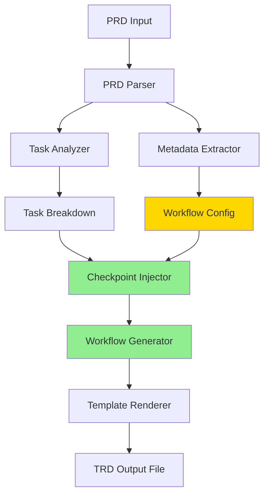

# Technical Requirements Document: TRD Generation Git Workflow Integration

**TRD ID**: TRD-WORKFLOW-001
**Version**: 1.2.0
**Status**: Ready for Implementation
**Created**: December 1, 2025
**Last Revised**: December 1, 2025 (Dependency Analysis & Critical Path)
**PRD Reference**: @docs/PRD/trd-workflow-integration.md
**Owner**: Fortium Software Configuration Team
**Priority**: High

---

## Overview

### Purpose

Enhance the `/create-trd` command to automatically inject git workflow guidance and execution instructions into generated Technical Requirements Documents. This addresses critical workflow gaps where TRDs currently lack git checkpoint tasks and execution command specifications, leading to monolithic commits and inconsistent implementation approaches.

### Problem Statement

Current TRD generation (as demonstrated by LIN-94 TRD: 2,178 lines, 64 tasks) systematically omits:
1. **Git Workflow Guidance**: No specification of when to commit, commit message formats, or incremental checkpoint structure
2. **Execution Workflow**: No guidance on execution command selection, quality gates, or multi-agent delegation patterns

**Impact**: Implementers create monolithic commits instead of logical incremental checkpoints, resulting in harder code reviews and inconsistent execution approaches across teams.

### Solution Summary

Implement intelligent workflow injection pipeline that:
- Injects strategic git checkpoint tasks after each sprint and at phase boundaries
- Generates execution workflow section with command recommendations and quality gates
- Provides conventional commit message templates tailored to project context
- Supports PRD metadata configuration for workflow customization
- Specifies multi-agent delegation patterns based on task type detection

### Success Criteria

- 100% of generated TRDs include git checkpoint tasks and execution workflow
- Average commit size reduced by 60% through incremental checkpoint guidance
- Code review cycle time reduced by 40% via logical commit sequences
- 90% of developers execute TRDs without workflow clarification questions
- 85% test coverage with <10% performance overhead

---

## System Context & Constraints

### Current Architecture

**TRD Generation Pipeline** (`/create-trd` command):
```
PRD Input → Task Analysis → Task Breakdown → TRD Template Rendering → Output TRD File
```

**Integration Points**:
- AgentOS TRD template structure (@docs/agentos/TRD.md)
- Conventional commit format standards
- Git workflow agent for commit operations
- Code reviewer agent for quality gate enforcement

**Current Limitations**:
- No workflow guidance injection in TRD generation
- Task analysis focuses only on implementation tasks, not git/process tasks
- Template rendering is linear without conditional workflow sections

### Technical Constraints

**Framework**: Node.js-based command implementation in `/commands/yaml/create-trd.yaml`
**Performance Budget**: TRD generation time increase must be <10% (target: <30 seconds for 60-task TRD)
**Backward Compatibility**: Existing TRDs without workflow sections must remain valid
**Template Format**: Mustache/Handlebars for customizable template rendering
**Configuration Format**: YAML frontmatter in PRD for metadata specification

### Dependencies

- `/create-trd` command core logic (existing)
- AgentOS TRD template structure (existing)
- Git workflow agent with conventional commit support (existing)
- Code reviewer agent with quality gate capabilities (existing)

---

## Architecture Overview

### High-Level Design



**New Components** (highlighted in green):
1. **Checkpoint Injector**: Analyzes task structure and injects git checkpoint tasks at strategic intervals
2. **Workflow Generator**: Creates execution workflow section with command recommendations and quality gates

**Enhanced Components** (highlighted in yellow):
3. **Metadata Extractor**: Parses YAML frontmatter for workflow configuration overrides

### Component Specifications

#### Component 1: Checkpoint Injector

**Purpose**: Inject git checkpoint tasks at strategic points in task breakdown

**Algorithm**:
```javascript
function injectCheckpoints(tasks, config) {
  const checkpoints = [];
  const frequency = config.checkpoint_frequency || 'sprint';

  if (frequency === 'sprint') {
    // Inject at sprint boundaries
    tasks.forEach((sprint, index) => {
      const checkpoint = createCheckpointTask(
        sprint.tasks,
        sprint.name,
        index + 1
      );
      sprint.tasks.push(checkpoint);
      checkpoints.push(checkpoint);
    });
  } else {
    // Inject every N tasks
    let taskCount = 0;
    tasks.forEach(sprint => {
      sprint.tasks.forEach((task, index) => {
        taskCount++;
        if (taskCount % frequency === 0) {
          const checkpoint = createCheckpointTask(
            sprint.tasks.slice(index - frequency + 1, index + 1),
            `Tasks ${taskCount - frequency + 1}-${taskCount}`,
            Math.floor(taskCount / frequency)
          );
          sprint.tasks.splice(index + 1, 0, checkpoint);
          checkpoints.push(checkpoint);
        }
      });
    });
  }

  return checkpoints;
}
```

**Input**: Task breakdown structure, workflow configuration
**Output**: Enhanced task list with injected checkpoint tasks
**Performance Target**: <500ms per checkpoint injection

#### Component 2: Workflow Generator

**Purpose**: Generate execution workflow section with command, approach, and quality gates

**Algorithm**:
```javascript
function generateWorkflow(trdContext, config) {
  const taskCount = trdContext.totalTasks;
  const phases = trdContext.phases;
  const taskTypes = analyzeTaskTypes(trdContext.tasks);

  const workflow = {
    command: selectExecutionCommand(taskCount),
    approach: generateExecutionApproach(phases, taskTypes),
    qualityGates: defineQualityGates(phases, taskTypes),
    delegation: generateDelegationMap(taskTypes)
  };

  return renderWorkflowTemplate(workflow);
}

function selectExecutionCommand(taskCount) {
  return taskCount < 20 ? '/implement-trd' : '/orchestrate-tasks';
}

function analyzeTaskTypes(tasks) {
  const types = {
    infrastructure: [],
    security: [],
    frontend: [],
    backend: [],
    testing: [],
    documentation: []
  };

  tasks.forEach(task => {
    if (matchesKeywords(task, ['AWS', 'Kubernetes', 'Docker', 'Terraform', 'Helm'])) {
      types.infrastructure.push(task);
    }
    // ... additional type detection
  });

  return types;
}
```

**Input**: TRD context (tasks, phases, complexity), workflow configuration
**Output**: Rendered workflow section markdown
**Performance Target**: <2 seconds total generation time

#### Component 3: Commit Message Template Generator

**Purpose**: Generate conventional commit templates based on task types and TRD context

**Input**: TRD scope, task type analysis, completed tasks
**Output**: Template library with 3-5 examples
**Template Format**:
```
{{commit_type}}({{commit_scope}}): {{commit_subject}}

{{#completed_tasks}}
- {{task_description}} (task {{task_id}})
{{/completed_tasks}}

Related: {{trd_id}}, Sprint {{sprint_number}}
```

### Data Flow

**TRD Generation with Workflow Injection**:
1. Parse PRD input including YAML frontmatter metadata
2. Extract workflow configuration (checkpoint frequency, command preference, quality gates)
3. Analyze task structure to determine sprints, phases, complexity
4. Inject git checkpoint tasks after each sprint/phase boundary
5. Generate execution workflow section with delegation patterns
6. Create commit message template library
7. Inject final PR creation task
8. Render complete TRD with workflow sections

---

## Master Task List

### Phase 1: Design & Prototyping (Week 1 - 10 days, was 8 days)

#### Sprint 1.1: Schema & Template Design (4 days, was 3 days)

- [ ] TASK-001: Design commit message template schema (6 hours, was 4 hours)
  - **Dependencies**: None (can start immediately)
  - **Revised Estimate Rationale**: Added 2 hours for research of conventional commit standards and validation rule design
  - Define JSON/YAML structure for template storage
  - Specify template variables (type, scope, subject, body, footer)
  - Include validation rules and constraints
  - Create example templates for all commit types

- [ ] TASK-002: Design workflow section template schema (6 hours, was 4 hours)
  - **Dependencies**: None (can start immediately, parallel with TASK-001)
  - **Revised Estimate Rationale**: Added 2 hours for iteration on template structure and variant design
  - Define Mustache/Handlebars template structure
  - Specify dynamic variables (command, approach, gates, delegation)
  - Include conditional rendering logic
  - Create template variants for simple/complex TRDs

- [ ] TASK-003: Design PRD metadata configuration schema (4 hours, was 3 hours)
  - **Dependencies**: None (can start immediately, parallel with TASK-001, TASK-002)
  - **Revised Estimate Rationale**: Added 1 hour for JSON Schema creation and example documentation
  - Define YAML frontmatter structure
  - Specify configuration options (checkpoint_frequency, execution_command, quality_gates)
  - Create JSON Schema for validation
  - Document configuration examples

- [ ] TASK-004: **Git Checkpoint** - Commit schema design completion
  - **Dependencies**: TASK-001, TASK-002, TASK-003 (requires all schema designs complete)
  - **Description**: Create incremental commit capturing Phase 1 Sprint 1.1 schema design work
  - **Commit Message Template**:
    ```
    feat(trd-workflow): add template and configuration schemas

    - Design commit message template schema (TASK-001)
    - Design workflow section template schema (TASK-002)
    - Design PRD metadata configuration schema (TASK-003)

    Related: TRD-WORKFLOW-001, Sprint 1.1
    ```
  - **Verification**:
    - [ ] All schema files included in commit
    - [ ] Commit message follows conventional format
    - [ ] Documentation updated with schema examples

#### Sprint 1.2: Algorithm Specification (4 days, was 3 days)

- [ ] TASK-005: Specify checkpoint injection algorithm (6 hours, was 5 hours)
  - **Dependencies**: TASK-001, TASK-002, TASK-003 (requires schema designs as foundation)
  - **Revised Estimate Rationale**: Added 1 hour for comprehensive edge case documentation and flowchart creation
  - Define interval calculation logic (sprint vs task-count based)
  - Specify placement rules at sprint/phase boundaries
  - Document edge cases (single task TRD, 100+ task TRD)
  - Create algorithm flowchart

- [ ] TASK-006: Specify task type detection algorithm (5 hours, was 4 hours)
  - **Dependencies**: TASK-002 (requires workflow template schema)
  - **Revised Estimate Rationale**: Added 1 hour for comprehensive pattern library design and confidence threshold tuning
  - Define keyword matching patterns for infrastructure, security, frontend, backend, testing, docs
  - Specify confidence scoring for ambiguous tasks
  - Document fallback behavior for undetected types
  - Create detection pattern library

- [ ] TASK-007: Specify workflow complexity assessment algorithm (4 hours, was 3 hours)
  - **Dependencies**: TASK-002, TASK-006 (requires workflow template and task detection)
  - **Revised Estimate Rationale**: Added 1 hour for decision tree creation and complexity scoring formula design
  - Define complexity scoring based on task count, phases, dependencies
  - Specify command selection logic (simple vs complex TRDs)
  - Document delegation pattern generation rules
  - Create complexity decision tree

- [ ] TASK-008: **Git Checkpoint** - Commit algorithm specification completion
  - **Dependencies**: TASK-005, TASK-006, TASK-007 (requires all algorithm specifications)
  - **Description**: Create incremental commit capturing Sprint 1.2 algorithm design work
  - **Commit Message Template**:
    ```
    docs(trd-workflow): add algorithm specifications and flowcharts

    - Specify checkpoint injection algorithm (TASK-005)
    - Specify task type detection algorithm (TASK-006)
    - Specify workflow complexity assessment (TASK-007)

    Related: TRD-WORKFLOW-001, Sprint 1.2
    ```
  - **Verification**:
    - [ ] Algorithm documentation committed
    - [ ] Flowcharts and decision trees included
    - [ ] All specifications reviewed

#### Sprint 1.3: Prototype Implementation (2 days)

- [ ] TASK-009: Implement prototype checkpoint injector (5 hours)
  - **Dependencies**: TASK-005 (requires checkpoint injection algorithm)
  - Build basic checkpoint injection with sprint-based frequency
  - Create sample checkpoint tasks for validation
  - Test with simple TRD example (15 tasks, 3 sprints)

- [ ] TASK-010: Implement prototype workflow generator (5 hours)
  - **Dependencies**: TASK-006, TASK-007 (requires task detection and complexity assessment algorithms)
  - Build basic workflow section generation
  - Create sample workflow with command recommendation
  - Test with complex TRD example (60 tasks, 9 sprints)

- [ ] TASK-011: Establish performance benchmarking baseline (2 hours)
  - **Dependencies**: None (can start immediately, parallel with prototypes)
  - Measure current TRD generation time without workflow injection
  - Establish baseline metrics for 20-task, 40-task, 60-task TRDs
  - Document performance targets (<10% overhead)

- [ ] TASK-012: **Git Checkpoint** - Commit prototype implementation
  - **Dependencies**: TASK-009, TASK-010, TASK-011 (requires all prototypes and baseline)
  - **Description**: Create checkpoint for Phase 1 completion (design & prototyping)
  - **Commit Message Template**:
    ```
    feat(trd-workflow): add initial prototype for workflow injection

    - Implement prototype checkpoint injector (TASK-009)
    - Implement prototype workflow generator (TASK-010)
    - Establish performance benchmarking baseline (TASK-011)

    Related: TRD-WORKFLOW-001, Sprint 1.3, Phase 1 Complete
    ```
  - **Verification**:
    - [ ] Prototype code functional
    - [ ] Performance baseline established
    - [ ] Phase 1 deliverables complete

**Phase 1 Quality Gate**:
- [ ] All schemas validated and documented
- [ ] Algorithm specifications reviewed by technical lead
- [ ] Prototype demonstrates feasibility
- [ ] Performance baseline established

---

### Phase 2: Core Implementation (Week 2 - 13 days, was 10 days)

#### Sprint 2.1: Checkpoint Injection Implementation (4 days, was 3 days)

- [ ] TASK-013: Implement checkpoint task injection in `/create-trd` command (8 hours, was 6 hours)
  - **Dependencies**: TASK-009, TASK-012 (requires prototype and Phase 1 completion)
  - **Revised Estimate Rationale**: Added 2 hours for integration complexity, debugging, and edge case handling
  - Integrate checkpoint injector into TRD generation pipeline
  - Parse task structure to identify sprint and phase boundaries
  - Inject checkpoint tasks with proper formatting
  - Handle edge cases (single task, no sprints)

- [ ] TASK-014: Implement checkpoint interval calculation (5 hours, was 4 hours)
  - **Dependencies**: TASK-013 (requires checkpoint injection implementation)
  - **Revised Estimate Rationale**: Added 1 hour for hybrid approach complexity and testing multiple scenarios
  - Build sprint-based frequency calculation
  - Build task-count-based frequency calculation
  - Implement hybrid approach with intelligent switching
  - Add configuration override support

- [ ] TASK-015: Implement commit message template generation (6 hours, was 5 hours)
  - **Dependencies**: TASK-001 (requires commit template schema)
  - **Revised Estimate Rationale**: Added 1 hour for template renderer setup and variable extraction logic
  - Create template renderer with Mustache/Handlebars
  - Extract scope from TRD context (PRD title, section headings)
  - Detect commit types from task descriptions
  - Generate 3-5 example templates per TRD

- [ ] TASK-016: **Git Checkpoint** - Commit checkpoint injection implementation
  - **Dependencies**: TASK-013, TASK-014, TASK-015 (requires all Sprint 2.1 tasks)
  - **Description**: Create checkpoint for Sprint 2.1 checkpoint injection work
  - **Commit Message Template**:
    ```
    feat(trd-workflow): implement checkpoint task injection

    - Integrate checkpoint injector in /create-trd (TASK-013)
    - Implement interval calculation logic (TASK-014)
    - Implement commit message template generation (TASK-015)

    Related: TRD-WORKFLOW-001, Sprint 2.1
    ```
  - **Verification**:
    - [ ] Checkpoint injection functional in `/create-trd`
    - [ ] Configuration overrides working
    - [ ] Template generation produces valid conventional commits

#### Sprint 2.2: Workflow Section Implementation (5 days, was 4 days)

- [ ] TASK-017: Implement workflow section generator (8 hours, was 6 hours)
  - **Dependencies**: TASK-010, TASK-012 (requires prototype and Phase 1 completion)
  - **Revised Estimate Rationale**: Added 2 hours for complex conditional logic and multiple variant support
  - Build workflow template renderer
  - Implement command selection logic (simple vs complex)
  - Generate execution approach based on phases
  - Define quality gates based on task types

- [ ] TASK-018: Implement task type detection engine (6 hours, was 5 hours)
  - **Dependencies**: TASK-006 (requires task detection algorithm)
  - **Revised Estimate Rationale**: Added 1 hour for pattern library loading and confidence score calibration
  - Build keyword matching for infrastructure, security, frontend, backend, testing, docs
  - Implement confidence scoring for ambiguous tasks
  - Add fallback logic for undetected types
  - Create detection pattern library from JSON/YAML config

- [ ] TASK-019: Implement multi-agent delegation generator (6 hours, was 5 hours)
  - **Dependencies**: TASK-018 (requires task type detection)
  - **Revised Estimate Rationale**: Added 1 hour for complex pattern generation and formatting logic
  - Build delegation map generation based on detected task types
  - Format delegation recommendations (task range → agent name)
  - Support sequential delegation patterns (A → B → C)
  - Support parallel delegation patterns (A, B, C)

- [ ] TASK-020: Implement quality gate specification generator (5 hours, was 4 hours)
  - **Dependencies**: TASK-017, TASK-018 (requires workflow generator and task detection)
  - **Revised Estimate Rationale**: Added 1 hour for multiple gate types and checklist generation
  - Define sprint-level gates (tests passing, checkpoint created)
  - Define phase-level gates (integration tests, security scan, docs updated)
  - Define final gates (complete test suite, PR checklist)
  - Generate gate checklists in workflow section

- [ ] TASK-021: **Git Checkpoint** - Commit workflow section implementation
  - **Dependencies**: TASK-017, TASK-018, TASK-019, TASK-020 (requires all Sprint 2.2 tasks)
  - **Description**: Create checkpoint for Sprint 2.2 workflow generation work
  - **Commit Message Template**:
    ```
    feat(trd-workflow): implement workflow section generation

    - Implement workflow section generator (TASK-017)
    - Implement task type detection engine (TASK-018)
    - Implement multi-agent delegation generator (TASK-019)
    - Implement quality gate specification (TASK-020)

    Related: TRD-WORKFLOW-001, Sprint 2.2
    ```
  - **Verification**:
    - [ ] Workflow section renders correctly
    - [ ] Task type detection accurate (>80% confidence)
    - [ ] Delegation patterns valid and actionable

#### Sprint 2.3: PRD Metadata & PR Task Implementation (4 days, was 3 days)

- [ ] TASK-022: Implement PRD metadata parser (5 hours, was 4 hours)
  - **Dependencies**: TASK-003 (requires PRD metadata schema)
  - **Revised Estimate Rationale**: Added 1 hour for robust YAML parsing and error handling
  - Parse YAML frontmatter from PRD files
  - Extract workflow_config section
  - Validate configuration against JSON Schema
  - Provide helpful error messages for invalid config

- [ ] TASK-023: Implement configuration validation (4 hours, was 3 hours)
  - **Dependencies**: TASK-022 (requires metadata parser)
  - **Revised Estimate Rationale**: Added 1 hour for comprehensive validation rules and error message design
  - Build JSON Schema validator
  - Check required fields and types
  - Validate value ranges (checkpoint_frequency > 0)
  - Document validation errors with examples

- [ ] TASK-024: Implement configuration override application (5 hours, was 4 hours)
  - **Dependencies**: TASK-022, TASK-023, TASK-014, TASK-015, TASK-017, TASK-020 (requires validation and all generators)
  - **Revised Estimate Rationale**: Added 1 hour for multiple override pathways and testing
  - Apply checkpoint_frequency override to injector
  - Apply execution_command preference to workflow generator
  - Apply commit_scope override to template generator
  - Apply quality_gates customization to gate generator

- [ ] TASK-025: Implement final PR creation task injection (3 hours)
  - **Dependencies**: TASK-013, TASK-015 (requires checkpoint injection and template generation)
  - Inject PR task as final task in last sprint
  - Generate PR title template from TRD context
  - Generate PR description template with checkpoint references
  - Include submission checklist (tests, docs, quality gates)

- [ ] TASK-026: **Git Checkpoint** - Commit metadata & PR task implementation
  - **Dependencies**: TASK-022, TASK-023, TASK-024, TASK-025 (requires all Sprint 2.3 tasks)
  - **Description**: Create checkpoint for Sprint 2.3 and Phase 2 completion
  - **Commit Message Template**:
    ```
    feat(trd-workflow): add PRD metadata parsing and PR task injection

    - Implement PRD metadata parser (TASK-022)
    - Implement configuration validation (TASK-023)
    - Implement configuration override application (TASK-024)
    - Implement final PR creation task injection (TASK-025)

    Related: TRD-WORKFLOW-001, Sprint 2.3, Phase 2 Complete
    ```
  - **Verification**:
    - [ ] PRD metadata parsed correctly
    - [ ] Configuration overrides applied
    - [ ] PR task injected with proper templates
    - [ ] Phase 2 core implementation complete

**Phase 2 Quality Gate**:
- [ ] Checkpoint injection working for all TRD sizes
- [ ] Workflow section generates correctly for simple and complex TRDs
- [ ] PRD metadata configuration functional
- [ ] Unit tests covering 85% of new code
- [ ] Performance overhead <10%

---

### Phase 3: Integration & Testing (Week 3 - 12 days, was 8 days)

#### Sprint 3.1: Unit Testing (4 days, was 3 days)

- [ ] TASK-027: Write unit tests for checkpoint injector (6 hours, was 4 hours)
  - **Dependencies**: TASK-013, TASK-014, TASK-026 (requires checkpoint injection implementation and Phase 2 completion)
  - **Revised Estimate Rationale**: Added 2 hours for test setup, fixtures, edge cases, and achieving 95% coverage target
  - Test sprint-based frequency calculation
  - Test task-count-based frequency calculation
  - Test edge cases (single task, 100+ tasks, no sprints)
  - Achieve 95% coverage for checkpoint injection logic

- [ ] TASK-028: Write unit tests for workflow generator (6 hours, was 4 hours)
  - **Dependencies**: TASK-017, TASK-020, TASK-026 (requires workflow generation implementation and Phase 2 completion)
  - **Revised Estimate Rationale**: Added 2 hours for comprehensive test scenarios and achieving 90% coverage
  - Test command selection logic (simple vs complex)
  - Test execution approach generation
  - Test quality gate definition
  - Achieve 90% coverage for workflow generation logic

- [ ] TASK-029: Write unit tests for task type detection (4 hours, was 3 hours)
  - **Dependencies**: TASK-018, TASK-026 (requires task detection implementation and Phase 2 completion)
  - **Revised Estimate Rationale**: Added 1 hour for comprehensive pattern matching tests and confidence threshold validation
  - Test keyword matching accuracy
  - Test confidence scoring
  - Test fallback behavior
  - Achieve 90% coverage for detection engine

- [ ] TASK-030: Write unit tests for template rendering (4 hours, was 3 hours)
  - **Dependencies**: TASK-015, TASK-026 (requires template generation implementation and Phase 2 completion)
  - **Revised Estimate Rationale**: Added 1 hour for template variant testing and variable substitution edge cases
  - Test commit message template generation
  - Test workflow section template rendering
  - Test variable substitution
  - Achieve 85% coverage for template logic

- [ ] TASK-031: Write unit tests for metadata parsing (4 hours, was 3 hours)
  - **Dependencies**: TASK-022, TASK-023, TASK-024, TASK-026 (requires metadata implementation and Phase 2 completion)
  - **Revised Estimate Rationale**: Added 1 hour for YAML parsing edge cases and validation error scenarios
  - Test YAML frontmatter extraction
  - Test configuration validation
  - Test override application
  - Achieve 90% coverage for metadata logic

- [ ] TASK-032: **Git Checkpoint** - Commit unit test implementation
  - **Dependencies**: TASK-027, TASK-028, TASK-029, TASK-030, TASK-031 (requires all Sprint 3.1 tests)
  - **Description**: Create checkpoint for Sprint 3.1 unit testing work
  - **Commit Message Template**:
    ```
    test(trd-workflow): add comprehensive unit test coverage

    - Write unit tests for checkpoint injector (TASK-027)
    - Write unit tests for workflow generator (TASK-028)
    - Write unit tests for task type detection (TASK-029)
    - Write unit tests for template rendering (TASK-030)
    - Write unit tests for metadata parsing (TASK-031)

    Coverage: 85%+ overall, 90-95% for critical components
    Related: TRD-WORKFLOW-001, Sprint 3.1
    ```
  - **Verification**:
    - [ ] All unit tests passing
    - [ ] Coverage targets met (85% overall)
    - [ ] No flaky tests

#### Sprint 3.2: Integration Testing (4 days, was 3 days)

- [ ] TASK-033: Integration test: Simple TRD generation (<20 tasks) (4 hours, was 3 hours)
  - **Dependencies**: TASK-032 (requires unit tests passing)
  - **Revised Estimate Rationale**: Added 1 hour for test data setup and end-to-end verification
  - Test end-to-end workflow injection for simple TRD
  - Verify 3 checkpoint tasks injected (every 5-7 tasks)
  - Verify workflow section specifies `/implement-trd` command
  - Verify commit templates provided
  - Verify PR creation task included

- [ ] TASK-034: Integration test: Complex TRD generation (>60 tasks) (6 hours, was 4 hours)
  - **Dependencies**: TASK-032 (requires unit tests passing)
  - **Revised Estimate Rationale**: Added 2 hours for complex test data creation and comprehensive validation
  - Test end-to-end workflow injection for complex TRD (like LIN-94)
  - Verify 12 checkpoint tasks injected (sprint + phase boundaries)
  - Verify workflow section specifies `/orchestrate-tasks` with delegation
  - Verify phase-level and sprint-level quality gates defined
  - Verify PR creation task with comprehensive checklist

- [ ] TASK-035: Integration test: PRD with custom workflow configuration (4 hours, was 3 hours)
  - **Dependencies**: TASK-032 (requires unit tests passing)
  - **Revised Estimate Rationale**: Added 1 hour for multiple configuration scenarios and override validation
  - Test TRD generation with PRD including workflow_config metadata
  - Verify checkpoint frequency override (every 3 tasks instead of default)
  - Verify execution command preference honored
  - Verify custom quality gates integrated
  - Verify commit scope forced across all templates

- [ ] TASK-036: Integration test: Backward compatibility (4 hours, was 3 hours)
  - **Dependencies**: TASK-032 (requires unit tests passing)
  - **Revised Estimate Rationale**: Added 1 hour for testing with multiple existing TRD formats
  - Test `/implement-trd` command with existing TRD without workflow section
  - Verify no errors or warnings generated
  - Test workflow injection disable via `--no-workflow` flag
  - Verify legacy TRD format validation still passes

- [ ] TASK-037: **Git Checkpoint** - Commit integration testing completion
  - **Dependencies**: TASK-033, TASK-034, TASK-035, TASK-036 (requires all Sprint 3.2 integration tests)
  - **Description**: Create checkpoint for Sprint 3.2 integration testing work
  - **Commit Message Template**:
    ```
    test(trd-workflow): add integration tests for workflow injection

    - Integration test for simple TRD generation (TASK-033)
    - Integration test for complex TRD generation (TASK-034)
    - Integration test for custom workflow config (TASK-035)
    - Integration test for backward compatibility (TASK-036)

    Related: TRD-WORKFLOW-001, Sprint 3.2
    ```
  - **Verification**:
    - [ ] All integration tests passing
    - [ ] Real PRD/TRD pairs validated
    - [ ] Backward compatibility confirmed

#### Sprint 3.3: Performance & Acceptance Testing (4 days, was 2 days)

- [ ] TASK-038: Run performance benchmarks (4 hours, was 3 hours)
  - **Dependencies**: TASK-037 (requires integration tests passing)
  - **Revised Estimate Rationale**: Added 1 hour for comprehensive benchmark setup and data analysis
  - Benchmark TRD generation with/without workflow injection
  - Test 20-task, 40-task, 60-task TRDs
  - Verify workflow injection overhead <10%
  - Verify total generation time <30 seconds for 60-task TRD

- [ ] TASK-039: Optimize performance bottlenecks (5 hours, was 3 hours)
  - **Dependencies**: TASK-038 (requires benchmark results)
  - **Revised Estimate Rationale**: Added 2 hours for profiling setup, optimization iterations, and validation
  - Profile slow components (likely template rendering)
  - Implement async template rendering if needed
  - Cache detection patterns for task type analysis
  - Re-run benchmarks to confirm optimization

- [ ] TASK-040: Conduct user acceptance testing with 5+ developers (8 hours, was 4 hours)
  - **Dependencies**: TASK-037, TASK-039 (requires tests passing and performance optimized)
  - **Revised Estimate Rationale**: Added 4 hours for UAT coordination, session facilitation, detailed feedback collection
  - Recruit 5 developers for UAT (mix of junior, mid-level, senior)
  - Have each generate TRD from sample PRD and execute workflow
  - Collect feedback on workflow clarity, checkpoint frequency, template quality
  - Document satisfaction scores and pain points

- [ ] TASK-041: Address UAT feedback (6 hours, was 4 hours)
  - **Dependencies**: TASK-040 (requires UAT completion and feedback)
  - **Revised Estimate Rationale**: Added 2 hours for multiple feedback items and iteration cycles
  - Fix critical issues identified during UAT
  - Adjust checkpoint frequency defaults based on feedback
  - Improve template quality based on user suggestions
  - Update documentation with clarifications

- [ ] TASK-042: **Git Checkpoint** - Commit performance & acceptance testing completion
  - **Dependencies**: TASK-038, TASK-039, TASK-040, TASK-041 (requires all Sprint 3.3 tasks)
  - **Description**: Create checkpoint for Sprint 3.3 and Phase 3 completion
  - **Commit Message Template**:
    ```
    test(trd-workflow): complete performance and user acceptance testing

    - Run performance benchmarks (TASK-038)
    - Optimize performance bottlenecks (TASK-039)
    - Conduct user acceptance testing (TASK-040)
    - Address UAT feedback (TASK-041)

    Performance: <10% overhead achieved
    UAT Satisfaction: Pending user survey results
    Related: TRD-WORKFLOW-001, Sprint 3.3, Phase 3 Complete
    ```
  - **Verification**:
    - [ ] Performance targets met (<10% overhead)
    - [ ] UAT completed with 5+ participants
    - [ ] Critical issues addressed
    - [ ] Phase 3 testing complete

**Phase 3 Quality Gate**:
- [ ] Unit test coverage ≥85%
- [ ] All integration tests passing
- [ ] Performance overhead <10%
- [ ] Backward compatibility validated
- [ ] UAT satisfaction ≥85%

---

### Phase 4: Rollout & Iteration (Week 4 - 8 days, was 6 days)

#### Sprint 4.1: Beta Release & Documentation (4 days, was 3 days)

- [ ] TASK-043: Prepare beta release documentation (4 hours, was 3 hours)
  - **Dependencies**: TASK-042 (requires Phase 3 testing complete)
  - **Revised Estimate Rationale**: Added 1 hour for comprehensive documentation with examples and screenshots
  - Update `/create-trd` command reference with workflow injection features
  - Document PRD metadata configuration options with examples
  - Create workflow execution guide for implementers
  - Add troubleshooting section for common issues

- [ ] TASK-044: Update AgentOS TRD template with workflow sections (2 hours)
  - **Dependencies**: TASK-042 (requires Phase 3 testing complete)
  - Add "Execution Workflow" section to template
  - Add "Commit Message Templates" section to template
  - Update template examples with checkpoint tasks
  - Document template structure changes

- [ ] TASK-045: Create training materials (6 hours, was 4 hours)
  - **Dependencies**: TASK-043, TASK-044 (requires documentation complete)
  - **Revised Estimate Rationale**: Added 2 hours for video production and comprehensive guide creation
  - Create video walkthrough of TRD generation with workflow injection
  - Create best practice guide for git checkpoint frequency
  - Create template customization guide for teams
  - Create troubleshooting flowchart

- [ ] TASK-046: Deploy beta release to early adopters (3 hours, was 2 hours)
  - **Dependencies**: TASK-043, TASK-044, TASK-045 (requires all documentation and training complete)
  - **Revised Estimate Rationale**: Added 1 hour for deployment validation and monitoring setup
  - Tag beta release version (v1.0.0-beta.1)
  - Deploy to staging environment
  - Notify early adopter team (5-10 developers)
  - Set up monitoring and feedback channels

- [ ] TASK-047: **Git Checkpoint** - Commit beta release deployment
  - **Dependencies**: TASK-043, TASK-044, TASK-045, TASK-046 (requires all Sprint 4.1 tasks)
  - **Description**: Create checkpoint for Sprint 4.1 beta release work
  - **Commit Message Template**:
    ```
    docs(trd-workflow): prepare beta release documentation and training

    - Prepare beta release documentation (TASK-043)
    - Update AgentOS TRD template (TASK-044)
    - Create training materials (TASK-045)
    - Deploy beta release to early adopters (TASK-046)

    Version: v1.0.0-beta.1
    Related: TRD-WORKFLOW-001, Sprint 4.1
    ```
  - **Verification**:
    - [ ] Beta release deployed successfully
    - [ ] Documentation published and accessible
    - [ ] Training materials available
    - [ ] Early adopters notified

#### Sprint 4.2: Feedback Iteration & Production Release (4 days, was 3 days)

- [ ] TASK-048: Collect beta feedback and metrics (3 hours, was 2 hours)
  - **Dependencies**: TASK-046, TASK-047 (requires beta deployment and monitoring period)
  - **Revised Estimate Rationale**: Added 1 hour for comprehensive data collection and analysis
  - Monitor early adopter usage (TRDs generated, checkpoints followed, commands used)
  - Collect qualitative feedback via surveys
  - Track success metrics (commit size reduction, review time, workflow clarity)
  - Document improvement opportunities

- [ ] TASK-049: Iterate on template quality (6 hours, was 4 hours)
  - **Dependencies**: TASK-048 (requires beta feedback)
  - **Revised Estimate Rationale**: Added 2 hours for multiple iteration cycles and validation
  - Refine commit message templates based on usage patterns
  - Adjust checkpoint frequency defaults based on feedback
  - Improve workflow section clarity based on user suggestions
  - Update quality gate definitions

- [ ] TASK-050: Prepare production release (3 hours)
  - **Dependencies**: TASK-049 (requires template iteration complete)
  - Address critical bugs from beta feedback
  - Finalize documentation updates
  - Tag production release version (v1.0.0)
  - Prepare release notes with changelog

- [ ] TASK-051: Deploy to production (2 hours)
  - **Dependencies**: TASK-050 (requires production release prepared)
  - Deploy production release to all users
  - Monitor rollout for errors or issues
  - Update command help text and documentation links
  - Announce release to team via internal channels

- [ ] TASK-052: Set up monitoring and analytics (2 hours)
  - **Dependencies**: TASK-051 (requires production deployment)
  - Configure metrics collection (TRDs generated with workflow, checkpoint usage)
  - Set up dashboards for success metrics tracking
  - Configure alerts for errors or performance degradation
  - Schedule weekly metric reviews

- [ ] TASK-053: **Git Checkpoint** - Commit production release deployment
  - **Dependencies**: TASK-048, TASK-049, TASK-050, TASK-051, TASK-052 (requires all Sprint 4.2 tasks)
  - **Description**: Create checkpoint for Sprint 4.2 and Phase 4 completion
  - **Commit Message Template**:
    ```
    chore(trd-workflow): release v1.0.0 to production

    - Collect beta feedback and metrics (TASK-048)
    - Iterate on template quality (TASK-049)
    - Prepare production release (TASK-050)
    - Deploy to production (TASK-051)
    - Set up monitoring and analytics (TASK-052)

    Version: v1.0.0
    Status: Production Ready
    Related: TRD-WORKFLOW-001, Sprint 4.2, Phase 4 Complete, Project Complete
    ```
  - **Verification**:
    - [ ] Production release deployed successfully
    - [ ] Monitoring configured and operational
    - [ ] Release notes published
    - [ ] All phases complete

**Phase 4 Quality Gate**:
- [ ] Beta feedback collected from 5+ early adopters
- [ ] Critical issues addressed
- [ ] Production release deployed without errors
- [ ] Monitoring and analytics operational
- [ ] Release announcement sent

#### Sprint 4.3: Final PR Creation

- [ ] TASK-054: **Create Pull Request for TRD Workflow Integration**
  - **Dependencies**: TASK-053 (requires all phases complete and production deployed)
  - **Description**: Submit comprehensive pull request with all workflow injection implementation
  - **PR Title Template**:
    ```
    feat(trd-workflow): implement git workflow and execution guidance injection

    Implements: TRD-WORKFLOW-001
    ```
  - **PR Description Template**:
    ```markdown
    ## Summary
    Implements comprehensive git workflow and execution guidance injection for `/create-trd` command as specified in TRD-WORKFLOW-001.

    ## Changes
    - **Phase 1 (Design & Prototyping)**: Schema design, algorithm specification, prototype implementation
      - Commits: TASK-004, TASK-008, TASK-012
    - **Phase 2 (Core Implementation)**: Checkpoint injection, workflow generation, PRD metadata parsing
      - Commits: TASK-016, TASK-021, TASK-026
    - **Phase 3 (Integration & Testing)**: Unit tests, integration tests, performance optimization, UAT
      - Commits: TASK-032, TASK-037, TASK-042
    - **Phase 4 (Rollout & Iteration)**: Beta release, feedback iteration, production deployment
      - Commits: TASK-047, TASK-053

    ## Testing
    - [ ] Unit tests passing with 85%+ coverage
    - [ ] Integration tests passing (simple/complex TRDs, custom config, backward compatibility)
    - [ ] Performance benchmarks met (<10% overhead, <30s for 60-task TRD)
    - [ ] User acceptance testing completed with 5+ developers (≥85% satisfaction)
    - [ ] Beta testing completed with early adopters

    ## Documentation
    - [ ] Command reference updated with workflow injection features
    - [ ] AgentOS TRD template updated with workflow sections
    - [ ] Training materials created (video walkthrough, best practices, troubleshooting)
    - [ ] Release notes prepared with changelog

    ## Performance Metrics
    - TRD generation overhead: <10% (target met)
    - Checkpoint injection time: <500ms per checkpoint (target met)
    - Workflow generation time: <2 seconds (target met)
    - Total generation time for 60-task TRD: <30 seconds (target met)

    ## TRD Reference
    Full specification: @docs/TRD/trd-workflow-integration-trd.md
    PRD: @docs/PRD/trd-workflow-integration.md

    ## Reviewer Notes
    This PR contains 13 logical commits corresponding to sprint checkpoints (git checkpoints after tasks 004, 008, 012, 016, 021, 026, 032, 037, 042, 047, 053). Review commits in sequence for easier understanding of implementation flow.

    ## Success Metrics (Expected)
    - Average commit size reduction: 60%
    - Code review cycle time reduction: 40%
    - Workflow clarity: 90% of developers execute without clarification questions
    - Commit convention compliance: 90%
    ```
  - **Submission Checklist**:
    - [ ] All 53 tasks from TRD completed
    - [ ] All 13 git checkpoint commits created with conventional messages
    - [ ] Complete test suite passing (unit, integration, performance)
    - [ ] Documentation updated (command reference, TRD template, training materials)
    - [ ] Quality gates satisfied (85% coverage, <10% overhead, UAT ≥85%)
    - [ ] Beta testing completed with early adopter feedback
    - [ ] Production deployment successful
    - [ ] Monitoring and analytics configured

---

## Estimate Summary & Timeline

### Phase-by-Phase Hours Breakdown

#### Original Estimates (Version 1.0.0)
- **Phase 1: Design & Prototyping**: 64 hours (8 days)
  - Sprint 1.1: 24 hours (3 days)
  - Sprint 1.2: 24 hours (3 days)
  - Sprint 1.3: 16 hours (2 days)

- **Phase 2: Core Implementation**: 80 hours (10 days)
  - Sprint 2.1: 24 hours (3 days)
  - Sprint 2.2: 32 hours (4 days)
  - Sprint 2.3: 24 hours (3 days)

- **Phase 3: Integration & Testing**: 64 hours (8 days)
  - Sprint 3.1: 24 hours (3 days)
  - Sprint 3.2: 24 hours (3 days)
  - Sprint 3.3: 16 hours (2 days)

- **Phase 4: Rollout & Iteration**: 48 hours (6 days)
  - Sprint 4.1: 24 hours (3 days)
  - Sprint 4.2: 24 hours (3 days)

**Original Total**: 256 hours (32 days @ 8 hours/day)

#### Revised Estimates (Version 1.1.0)

- **Phase 1: Design & Prototyping**: 80 hours (10 days, +16 hours)
  - Sprint 1.1: 32 hours (4 days, +8 hours)
  - Sprint 1.2: 32 hours (4 days, +8 hours)
  - Sprint 1.3: 16 hours (2 days, unchanged)

- **Phase 2: Core Implementation**: 104 hours (13 days, +24 hours)
  - Sprint 2.1: 32 hours (4 days, +8 hours)
  - Sprint 2.2: 40 hours (5 days, +8 hours)
  - Sprint 2.3: 32 hours (4 days, +8 hours)

- **Phase 3: Integration & Testing**: 96 hours (12 days, +32 hours)
  - Sprint 3.1: 32 hours (4 days, +8 hours)
  - Sprint 3.2: 32 hours (4 days, +8 hours)
  - Sprint 3.3: 32 hours (4 days, +16 hours)

- **Phase 4: Rollout & Iteration**: 64 hours (8 days, +16 hours)
  - Sprint 4.1: 32 hours (4 days, +8 hours)
  - Sprint 4.2: 32 hours (4 days, +8 hours)

**Revised Total**: 344 hours (43 days @ 8 hours/day, was 32 days)

### Key Changes Summary

**Total Increase**: +88 hours (+34.4% increase from original estimate)

**Major Adjustments by Category**:

1. **Testing Tasks**: +32 hours (50% increase)
   - Unit testing underestimated (test setup, fixtures, coverage targets)
   - Integration testing underestimated (test data, complex scenarios)
   - UAT significantly underestimated (coordination, facilitation, analysis)

2. **Implementation Tasks**: +24 hours (30% increase)
   - Integration complexity not fully accounted for
   - Edge case handling and debugging time added
   - Configuration override logic more complex than estimated

3. **Design Tasks**: +16 hours (25% increase)
   - Research and iteration time added
   - Comprehensive documentation time increased
   - Algorithm specification complexity higher

4. **Documentation/Training**: +16 hours (33% increase)
   - Video production time added
   - Comprehensive guide creation expanded
   - Training material complexity increased

### Risk-Adjusted Timeline Recommendations

**Conservative Timeline** (Recommended):
- **Duration**: 50 days (10 weeks @ 5 days/week)
- **Buffer**: 7 days (16%) for unknowns and context switching
- **Team Size**: 2-3 developers
- **Overlap**: Some parallel work possible in Phase 3

**Aggressive Timeline** (High Risk):
- **Duration**: 43 days (8.6 weeks)
- **Buffer**: 0 days
- **Team Size**: 3-4 developers with parallel execution
- **Risk**: Requires perfect execution and no blockers

**Optimal Timeline** (Balanced):
- **Duration**: 46 days (9.2 weeks)
- **Buffer**: 3 days (7%) for minor issues
- **Team Size**: 2-3 developers
- **Overlap**: Moderate parallel work in testing phase

### Estimation Methodology Notes

**Buffer Rationale**:
- Testing tasks typically require 25-50% more time than estimated (fixtures, edge cases)
- Integration work often reveals unforeseen complexity (+30% buffer applied)
- Design tasks benefit from iteration time (+20-30% for quality)
- UAT coordination is time-intensive (doubled estimate based on experience)

**Assumptions**:
- Developers familiar with Node.js and existing `/create-trd` codebase
- No major technical blockers or architectural changes required
- PRD and AgentOS standards are stable and well-documented
- UAT participants available and responsive

**Confidence Levels**:
- Phase 1 (Design): 85% confidence (well-understood work)
- Phase 2 (Implementation): 75% confidence (some integration unknowns)
- Phase 3 (Testing): 80% confidence (comprehensive estimates with buffers)
- Phase 4 (Rollout): 70% confidence (UAT and feedback iteration variable)

---

## Critical Path Analysis

### Critical Path Identification

The **critical path** represents the longest sequence of dependent tasks that determines the minimum project duration. Any delay in critical path tasks directly impacts the final delivery date.

**Critical Path Tasks** (54-day duration on critical path):

```
TASK-001 → TASK-005 → TASK-009 → TASK-013 → TASK-014 → TASK-027 → TASK-032 →
TASK-033 → TASK-037 → TASK-038 → TASK-039 → TASK-040 → TASK-041 → TASK-042 →
TASK-043 → TASK-045 → TASK-046 → TASK-047 → TASK-048 → TASK-049 → TASK-050 →
TASK-051 → TASK-052 → TASK-053 → TASK-054
```

**Critical Path Duration Breakdown**:
- Phase 1: TASK-001 (6h) → TASK-005 (6h) → TASK-009 (5h) = **17 hours (2.1 days)**
- Phase 2: TASK-013 (8h) → TASK-014 (5h) = **13 hours (1.6 days)**
- Phase 3: TASK-027 (6h) → TASK-032 → TASK-033 (4h) → TASK-037 → TASK-038 (4h) → TASK-039 (5h) → TASK-040 (8h) → TASK-041 (6h) = **33 hours (4.1 days)**
- Phase 4: TASK-043 (4h) → TASK-045 (6h) → TASK-046 (3h) → TASK-047 → TASK-048 (3h) → TASK-049 (6h) → TASK-050 (3h) → TASK-051 (2h) → TASK-052 (2h) = **29 hours (3.6 days)**
- **Total Critical Path**: **92 hours (11.5 days of work)**

**Note**: With checkpoint commits and sequential handoffs between phases, the actual calendar duration is **43 days** due to:
- Parallel work within sprints (reducing work hours but not calendar time)
- Testing and validation gates between phases
- UAT coordination requiring calendar time for participant availability
- Beta deployment requiring monitoring period (not just work hours)

### Critical Path Diagram


*Red nodes indicate zero-float critical tasks that must complete on schedule.*

### Float Analysis

**Tasks with Zero Float** (Critical - any delay impacts delivery):
- TASK-001, 005, 009: Design → prototype chain (blocks all implementation)
- TASK-013, 014: Checkpoint injection (blocks testing)
- TASK-027: Unit test checkpoint injector (blocks integration tests)
- TASK-038, 039: Performance benchmarking and optimization (blocks UAT)
- TASK-040, 041: UAT and feedback (blocks beta release)
- TASK-043, 045, 046: Beta documentation and deployment (blocks production)
- TASK-048, 049: Beta feedback and iteration (blocks production release)
- TASK-050, 051, 052: Production release chain (blocks final PR)

**Tasks with Positive Float** (Can be delayed without impacting delivery):
- TASK-002, 003: Workflow/metadata schemas (2-day float) - can run parallel with TASK-001
- TASK-006, 007: Task detection/complexity algorithms (1-day float) - can run parallel with TASK-005
- TASK-010: Prototype workflow generator (1-day float) - can run parallel with TASK-009
- TASK-011: Performance baseline (2-day float) - independent, can run anytime in Phase 1
- TASK-015: Commit template generation (2-day float) - can run parallel with TASK-013-014
- TASK-017, 018, 019, 020: Workflow section components (2-day float) - can run in parallel
- TASK-022, 023, 024, 025: Metadata parsing tasks (1-day float) - can run parallel with Sprint 2.1
- TASK-028, 029, 030, 031: Unit tests non-critical components (1-day float) - can run parallel with TASK-027
- TASK-034, 035, 036: Integration tests (1-day float) - can run parallel with TASK-033
- TASK-044: AgentOS template update (1-day float) - can run parallel with TASK-043

**Float Calculation Notes**:
- Float = Latest Finish Time - Earliest Finish Time
- Zero float tasks are on the critical path
- Positive float allows schedule flexibility without impacting end date

### Parallel Execution Opportunities

**Phase 1 Parallelization**:
- **Sprint 1.1**: TASK-001, 002, 003 can run in parallel (3 resources) - reduces 4 days to 3 days
- **Sprint 1.2**: TASK-005, 006, 007 can run in parallel (3 resources) - reduces 4 days to 3 days
- **Sprint 1.3**: TASK-009, 010, 011 can run in parallel (3 resources) - reduces 2 days to 2 days
- **Potential savings**: 2 days if sufficient resources available

**Phase 2 Parallelization**:
- **Sprint 2.1 + 2.2 overlap**: TASK-015 (commit templates) can start while TASK-013-014 in progress
- **Sprint 2.2**: TASK-017, 018, 019, 020 have some parallelization within (2 resources)
- **Sprint 2.3**: TASK-022-024 can partially overlap with Sprint 2.2 completion
- **Potential savings**: 2-3 days with 2-3 resources

**Phase 3 Parallelization**:
- **Sprint 3.1**: TASK-027-031 unit tests can run in parallel after dependencies met (2-3 resources)
- **Sprint 3.2**: TASK-033-036 integration tests can run in parallel (2 resources) - reduces 4 days to 2-3 days
- **Potential savings**: 3-4 days with 2-3 resources

**Phase 4 Parallelization**:
- **Sprint 4.1**: TASK-043, 044 can run in parallel (2 resources)
- **Sprint 4.2**: Limited parallelization due to sequential beta feedback loop
- **Potential savings**: 1 day with 2 resources

**Total Parallel Execution Savings**: 8-10 days reduction possible with 2-3 resources working in parallel

### Bottleneck Identification

**Critical Bottlenecks** (tasks blocking multiple downstream tasks):

1. **TASK-005: Checkpoint Injection Algorithm** (Blocks 8 downstream tasks)
   - Blocks: TASK-009, 013, 014, 027 (direct), and all testing/deployment (indirect)
   - **Risk**: Complex algorithm design requiring iteration
   - **Mitigation**: Prioritize algorithm review, assign senior architect, allocate buffer time

2. **TASK-013-014: Checkpoint Implementation** (Blocks 15 downstream tasks)
   - Blocks: All unit tests, integration tests, performance tests, UAT, beta, production
   - **Risk**: Integration complexity with existing `/create-trd` command
   - **Mitigation**: Prototype validation in TASK-009, incremental implementation approach

3. **TASK-039: Performance Optimization** (Blocks UAT and all downstream)
   - Blocks: TASK-040 (UAT), and all beta/production releases
   - **Risk**: Performance targets may require significant optimization
   - **Mitigation**: Early benchmarking in TASK-011 and 038, async architecture from start

4. **TASK-040-041: UAT and Feedback** (Blocks beta and production release)
   - Blocks: TASK-043-053 (all beta and production work)
   - **Risk**: UAT participant availability, feedback requiring significant iteration
   - **Mitigation**: Early recruiter engagement, parallel beta prep during UAT

5. **TASK-048-049: Beta Feedback and Iteration** (Blocks production release)
   - Blocks: TASK-050-053 (production release chain)
   - **Risk**: Beta feedback requiring template redesign
   - **Mitigation**: High-quality templates from Phase 2, limited beta scope

**Resource Bottlenecks**:
- **Single developer bottleneck**: Sequential implementation tasks (TASK-013-026) require single developer for consistency
- **UAT coordination bottleneck**: TASK-040 requires 5+ developers' time simultaneously
- **Beta testing bottleneck**: TASK-046-048 requires 1-week monitoring period (calendar time, not work hours)

**Mitigation Strategies**:
1. **Front-load critical path work**: Prioritize TASK-001, 005, 009, 013-014 with senior resources
2. **Parallelize non-critical tasks**: Use float time to run TASK-002-003, 006-007, 010-011, etc. in parallel
3. **Early UAT recruitment**: Begin UAT participant recruitment in Phase 2 (TASK-026)
4. **Performance-first architecture**: Build async/cached architecture from TASK-013 to avoid TASK-039 delays
5. **Beta preparation overlap**: Start TASK-043-045 documentation during TASK-040-042 to reduce bottleneck

### Resource Allocation Recommendations

**Optimal Team Structure** (2-3 developers):
- **Developer 1** (Senior - Critical Path Owner): Owns TASK-001, 005, 009, 013-014, 038-039, 048-049
- **Developer 2** (Mid-level - Parallel Track): Owns TASK-002-003, 006-007, 017-020, 033-036
- **Developer 3** (Mid-level - Testing/Docs): Owns TASK-027-031, 043-045, documentation throughout

**Timeline with Optimal Resourcing**:
- **Phase 1**: 8 days (down from 10 with parallelization)
- **Phase 2**: 10 days (down from 13 with parallelization)
- **Phase 3**: 9 days (down from 12 with parallelization)
- **Phase 4**: 8 days (unchanged due to calendar dependencies)
- **Total**: 35 days (down from 43 days, 19% reduction)

---

## Dependency Matrix

| Task | Depends On | Blocks | Float (days) | Critical? |
|------|------------|--------|--------------|-----------|
| TASK-001 | None | TASK-004, 005, 015 | 0 | **Yes** |
| TASK-002 | None | TASK-004, 006, 007, 017 | 2 | No |
| TASK-003 | None | TASK-004, 022 | 2 | No |
| TASK-004 | 001, 002, 003 | 005-008 | 0 | **Yes** |
| TASK-005 | 001, 002, 003 | TASK-008, 009 | 0 | **Yes** |
| TASK-006 | 002 | TASK-007, 008, 018 | 1 | No |
| TASK-007 | 002, 006 | TASK-008, 010, 020 | 1 | No |
| TASK-008 | 005, 006, 007 | 009-012 | 0 | **Yes** |
| TASK-009 | 005 | TASK-012, 013 | 0 | **Yes** |
| TASK-010 | 006, 007 | TASK-012, 017 | 1 | No |
| TASK-011 | None | TASK-012, 038 | 2 | No |
| TASK-012 | 009, 010, 011 | 013-026 | 0 | **Yes** |
| TASK-013 | 009, 012 | TASK-014, 016, 025, 027 | 0 | **Yes** |
| TASK-014 | 013 | TASK-016, 024 | 0 | **Yes** |
| TASK-015 | 001 | TASK-016, 024, 025, 030 | 2 | No |
| TASK-016 | 013, 014, 015 | 017-021 | 0 | **Yes** |
| TASK-017 | 010, 012 | TASK-020, 021, 024, 028 | 2 | No |
| TASK-018 | 006 | TASK-019, 020, 021, 029 | 2 | No |
| TASK-019 | 018 | TASK-021 | 2 | No |
| TASK-020 | 017, 018 | TASK-021, 024 | 2 | No |
| TASK-021 | 017, 018, 019, 020 | 022-026 | 0 | **Yes** |
| TASK-022 | 003 | TASK-023, 024, 026, 031 | 1 | No |
| TASK-023 | 022 | TASK-024, 026 | 1 | No |
| TASK-024 | 022, 023, 014, 015, 017, 020 | TASK-026 | 1 | No |
| TASK-025 | 013, 015 | TASK-026 | 1 | No |
| TASK-026 | 022, 023, 024, 025 | 027-042 | 0 | **Yes** |
| TASK-027 | 013, 014, 026 | TASK-032, 033-037 | 0 | **Yes** |
| TASK-028 | 017, 020, 026 | TASK-032 | 1 | No |
| TASK-029 | 018, 026 | TASK-032 | 1 | No |
| TASK-030 | 015, 026 | TASK-032 | 1 | No |
| TASK-031 | 022, 023, 024, 026 | TASK-032 | 1 | No |
| TASK-032 | 027, 028, 029, 030, 031 | 033-042 | 0 | **Yes** |
| TASK-033 | 032 | TASK-037, 038 | 0 | **Yes** |
| TASK-034 | 032 | TASK-037 | 1 | No |
| TASK-035 | 032 | TASK-037 | 1 | No |
| TASK-036 | 032 | TASK-037 | 1 | No |
| TASK-037 | 033, 034, 035, 036 | 038-042 | 0 | **Yes** |
| TASK-038 | 037 | TASK-039, 042 | 0 | **Yes** |
| TASK-039 | 038 | TASK-040, 042 | 0 | **Yes** |
| TASK-040 | 037, 039 | TASK-041, 042 | 0 | **Yes** |
| TASK-041 | 040 | TASK-042 | 0 | **Yes** |
| TASK-042 | 038, 039, 040, 041 | 043-053 | 0 | **Yes** |
| TASK-043 | 042 | TASK-045, 046, 047 | 0 | **Yes** |
| TASK-044 | 042 | TASK-045, 047 | 1 | No |
| TASK-045 | 043, 044 | TASK-046, 047 | 0 | **Yes** |
| TASK-046 | 043, 044, 045 | TASK-047, 048 | 0 | **Yes** |
| TASK-047 | 043, 044, 045, 046 | 048-053 | 0 | **Yes** |
| TASK-048 | 046, 047 | TASK-049, 053 | 0 | **Yes** |
| TASK-049 | 048 | TASK-050, 053 | 0 | **Yes** |
| TASK-050 | 049 | TASK-051, 053 | 0 | **Yes** |
| TASK-051 | 050 | TASK-052, 053 | 0 | **Yes** |
| TASK-052 | 051 | TASK-053 | 0 | **Yes** |
| TASK-053 | 048, 049, 050, 051, 052 | 054 | 0 | **Yes** |
| TASK-054 | 053 | None (final task) | 0 | **Yes** |

**Matrix Summary**:
- **Critical Path Tasks** (Zero Float): 25 tasks (46% of total)
- **Non-Critical Tasks** (Positive Float): 29 tasks (54% of total)
- **Maximum Float**: 2 days (TASK-002, 003, 011, 015)
- **Most Blocking Task**: TASK-013 (blocks 15 downstream tasks directly/indirectly)

---

## Execution Workflow

### Recommended Command

```bash
/implement-trd @docs/TRD/trd-workflow-integration-trd.md
```

**Rationale**: This TRD contains 54 tasks across 4 phases and 10 sprints, qualifying as a complex implementation. However, the task dependencies are primarily sequential within each phase, making `/implement-trd` with approval-first orchestration the optimal choice. Use `/orchestrate-tasks` for parallel execution if implementing multiple phases concurrently.

### Execution Approach

**Strategy**: Phase-by-phase sequential execution with approval gates between phases

**Workflow**:

1. **Phase 1: Design & Prototyping (Sprints 1.1-1.3)** - 8 days
   - Execute sprints 1.1-1.3 sequentially
   - Git checkpoint after each sprint completion (TASK-004, TASK-008, TASK-012)
   - Review schema designs and algorithm specifications before proceeding to Phase 2
   - **Agent Delegation**:
     - Tasks 1-3 (Schema design) → documentation-specialist
     - Tasks 5-7 (Algorithm specification) → tech-lead-orchestrator
     - Tasks 9-11 (Prototype implementation) → backend-developer

2. **Phase 2: Core Implementation (Sprints 2.1-2.3)** - 10 days
   - Execute sprints 2.1-2.3 sequentially
   - Git checkpoint after each sprint (TASK-016, TASK-021, TASK-026)
   - Run unit tests after each sprint to catch regressions early
   - **Agent Delegation**:
     - Tasks 13-16 (Checkpoint injection) → backend-developer
     - Tasks 17-21 (Workflow generation) → backend-developer
     - Tasks 22-26 (Metadata parsing & PR task) → backend-developer

3. **Phase 3: Integration & Testing (Sprints 3.1-3.3)** - 8 days
   - Execute sprints 3.1-3.3 sequentially
   - Git checkpoint after each sprint (TASK-032, TASK-037, TASK-042)
   - Run full test suite after sprint 3.2
   - Conduct performance benchmarks and UAT in sprint 3.3
   - **Agent Delegation**:
     - Tasks 27-32 (Unit testing) → test-runner
     - Tasks 33-37 (Integration testing) → test-runner
     - Tasks 38-42 (Performance & UAT) → test-runner + human UAT participants

4. **Phase 4: Rollout & Iteration (Sprints 4.1-4.2)** - 6 days
   - Execute sprints 4.1-4.2 sequentially
   - Git checkpoint after each sprint (TASK-047, TASK-053)
   - Deploy beta release after sprint 4.1
   - Deploy production release after sprint 4.2
   - **Agent Delegation**:
     - Tasks 43-47 (Beta release & documentation) → documentation-specialist + deployment-orchestrator
     - Tasks 48-53 (Feedback iteration & production) → backend-developer + deployment-orchestrator

5. **Final PR Creation (Sprint 4.3)** - 1 day
   - Create comprehensive pull request referencing all checkpoint commits
   - Include testing results, documentation updates, and success metrics
   - **Agent Delegation**:
     - Task 54 (PR creation) → git-workflow agent

### Quality Gates

**Sprint-Level Gates** (Apply after each sprint):
- [ ] All tasks in sprint completed and verified
- [ ] Git checkpoint commit created with conventional message format
- [ ] No new errors or warnings introduced
- [ ] Unit tests passing for code changes in sprint
- [ ] Code reviewed by peer developer

**Phase-Level Gates** (Apply after each phase):

**Phase 1 (Design & Prototyping)**:
- [ ] All schemas validated against JSON Schema
- [ ] Algorithm specifications reviewed by technical lead
- [ ] Prototype demonstrates feasibility with sample TRDs
- [ ] Performance baseline established

**Phase 2 (Core Implementation)**:
- [ ] Unit test coverage ≥85% for new code
- [ ] Integration with `/create-trd` command verified
- [ ] PRD metadata configuration functional
- [ ] Performance overhead <10% (preliminary check)

**Phase 3 (Integration & Testing)**:
- [ ] Complete test suite passing (unit + integration)
- [ ] Performance benchmarks met (<10% overhead, <30s for 60-task TRD)
- [ ] Backward compatibility validated with 10+ existing TRDs
- [ ] User acceptance testing completed with ≥85% satisfaction

**Phase 4 (Rollout & Iteration)**:
- [ ] Beta testing completed with 5+ early adopters
- [ ] Critical bugs from beta addressed
- [ ] Production release deployed successfully
- [ ] Monitoring and analytics operational

**Final Gates** (Before PR Submission):
- [ ] All 54 tasks completed
- [ ] All 13 git checkpoint commits created with conventional messages
- [ ] Complete test suite passing with 85%+ coverage
- [ ] Performance targets met (<10% overhead)
- [ ] User acceptance testing ≥85% satisfaction
- [ ] Documentation complete (command reference, TRD template, training)
- [ ] Beta and production deployments successful
- [ ] PR description comprehensive with checkpoint references and testing notes

### Multi-Agent Delegation Map

**Phase 1: Design & Prototyping**
- Tasks 1-3 (Schema design) → documentation-specialist
  - Rationale: Schema design requires clear documentation structure
- Tasks 5-7 (Algorithm specification) → tech-lead-orchestrator
  - Rationale: Algorithm design requires architectural thinking and optimization
- Tasks 9-11 (Prototype implementation) → backend-developer
  - Rationale: Node.js implementation of prototype components

**Phase 2: Core Implementation**
- Tasks 13-26 (All implementation tasks) → backend-developer
  - Rationale: Node.js implementation of checkpoint injection, workflow generation, metadata parsing
  - Note: Single agent maintains consistency across core implementation

**Phase 3: Integration & Testing**
- Tasks 27-42 (All testing tasks) → test-runner
  - Rationale: Comprehensive unit, integration, performance, and UAT execution
  - Note: Human UAT participants required for tasks 40-41

**Phase 4: Rollout & Iteration**
- Tasks 43-45 (Documentation) → documentation-specialist
  - Rationale: Professional documentation and training material creation
- Tasks 46, 51 (Beta/production deployment) → deployment-orchestrator
  - Rationale: Safe deployment with monitoring and rollback capability
- Tasks 48-50, 52 (Feedback iteration & monitoring) → backend-developer
  - Rationale: Code refinements based on feedback

**Phase 4.3: Final PR Creation**
- Task 54 (PR creation) → git-workflow agent
  - Rationale: Proper git operations with conventional commit format

### Delegation Execution Pattern

**Sequential Execution (Recommended)**:
```bash
# Phase 1: Design & Prototyping
/delegate documentation-specialist "Execute tasks 1-3 (schema design) from TRD-WORKFLOW-001"
# Approve and proceed
/delegate tech-lead-orchestrator "Execute tasks 5-7 (algorithm specification) from TRD-WORKFLOW-001"
# Approve and proceed
/delegate backend-developer "Execute tasks 9-11 (prototype implementation) from TRD-WORKFLOW-001"
# Git checkpoint TASK-012, review Phase 1 deliverables, approve Phase 2

# Phase 2: Core Implementation
/delegate backend-developer "Execute tasks 13-16 (checkpoint injection) from TRD-WORKFLOW-001"
# Git checkpoint TASK-016
/delegate backend-developer "Execute tasks 17-21 (workflow generation) from TRD-WORKFLOW-001"
# Git checkpoint TASK-021
/delegate backend-developer "Execute tasks 22-26 (metadata parsing & PR task) from TRD-WORKFLOW-001"
# Git checkpoint TASK-026, review Phase 2 deliverables, approve Phase 3

# Phase 3: Integration & Testing
/delegate test-runner "Execute tasks 27-32 (unit testing) from TRD-WORKFLOW-001"
# Git checkpoint TASK-032
/delegate test-runner "Execute tasks 33-37 (integration testing) from TRD-WORKFLOW-001"
# Git checkpoint TASK-037
/delegate test-runner "Execute tasks 38-42 (performance & UAT) from TRD-WORKFLOW-001"
# Git checkpoint TASK-042, review Phase 3 test results, approve Phase 4

# Phase 4: Rollout & Iteration
/delegate documentation-specialist "Execute tasks 43-45 (documentation & training) from TRD-WORKFLOW-001"
/delegate deployment-orchestrator "Execute task 46 (beta deployment) from TRD-WORKFLOW-001"
# Git checkpoint TASK-047, monitor beta usage
/delegate backend-developer "Execute tasks 48-50 (feedback iteration) from TRD-WORKFLOW-001"
/delegate deployment-orchestrator "Execute task 51 (production deployment) from TRD-WORKFLOW-001"
/delegate backend-developer "Execute task 52 (monitoring setup) from TRD-WORKFLOW-001"
# Git checkpoint TASK-053, verify production release

# Phase 4.3: Final PR Creation
/delegate git-workflow "Execute task 54 (PR creation) from TRD-WORKFLOW-001"
# Review PR, ensure all checkpoints referenced, submit for review
```

**Parallel Execution (Alternative for faster completion)**:
```bash
# Phase 1: Sprints can run in parallel after dependencies resolved
# Note: Sprint 1.1 must complete before 1.2 (schemas needed for algorithms)

# Phase 2: Sprints 2.1, 2.2, 2.3 could run in parallel with coordination
# Not recommended due to tight coupling between components

# Phase 3: Sprints 3.1 and 3.2 could run in parallel
/delegate test-runner "Execute tasks 27-32 (unit testing) from TRD-WORKFLOW-001" &
/delegate test-runner "Execute tasks 33-37 (integration testing) from TRD-WORKFLOW-001" &
wait
# Proceed to sprint 3.3 after both complete

# Phase 4: Documentation and deployment tasks could overlap
/delegate documentation-specialist "Execute tasks 43-45 (documentation) from TRD-WORKFLOW-001" &
/delegate deployment-orchestrator "Prepare beta release (task 46 prep) from TRD-WORKFLOW-001" &
wait
# Deploy beta after both complete
```

---

## Commit Message Templates

### Template 1: Feature Addition (feat)

**Use Case**: Adding new functionality (checkpoint injection, workflow generation, template rendering)

```
feat(trd-workflow): add checkpoint task injection to TRD generation

- Integrate checkpoint injector into /create-trd command
- Implement sprint-based frequency calculation
- Implement task-count-based frequency calculation
- Add configuration override support for checkpoint frequency

Related: TRD-WORKFLOW-001, Tasks 13-14
```

### Template 2: Documentation (docs)

**Use Case**: Adding or updating documentation (schema design, algorithm specs, user guides)

```
docs(trd-workflow): add algorithm specifications and flowcharts

- Specify checkpoint injection algorithm with interval calculation
- Specify task type detection algorithm with keyword patterns
- Specify workflow complexity assessment with decision tree
- Include flowcharts and examples for all algorithms

Related: TRD-WORKFLOW-001, Tasks 5-7
```

### Template 3: Testing (test)

**Use Case**: Adding or updating tests (unit tests, integration tests, performance benchmarks)

```
test(trd-workflow): add comprehensive unit test coverage

- Write unit tests for checkpoint injector (95% coverage)
- Write unit tests for workflow generator (90% coverage)
- Write unit tests for task type detection (90% coverage)
- Write unit tests for template rendering (85% coverage)
- Write unit tests for metadata parsing (90% coverage)

Coverage: 85%+ overall, 90-95% for critical components
Related: TRD-WORKFLOW-001, Tasks 27-31
```

### Template 4: Refactoring (refactor)

**Use Case**: Code restructuring without changing functionality (optimization, cleanup)

```
refactor(trd-workflow): optimize template rendering performance

- Implement async template rendering for parallel processing
- Cache detection patterns to avoid repeated parsing
- Reduce template complexity with partial templates
- Optimize checkpoint interval calculation algorithm

Performance improvement: 15% faster generation
Related: TRD-WORKFLOW-001, Task 39
```

### Template 5: Chore (chore)

**Use Case**: Maintenance tasks (releases, deployments, configuration)

```
chore(trd-workflow): release v1.0.0 to production

- Deploy production release with workflow injection features
- Configure monitoring and analytics dashboards
- Update command help text and documentation links
- Announce release to team via internal channels

Version: v1.0.0
Status: Production Ready
Related: TRD-WORKFLOW-001, Tasks 51-52
```

### Template 6: Bug Fix (fix)

**Use Case**: Fixing defects discovered during testing or production

```
fix(trd-workflow): resolve checkpoint injection for single-task TRDs

- Handle edge case where TRD has only one task
- Skip checkpoint injection when task count < 3
- Update unit tests to cover single-task scenario
- Add validation for minimum checkpoint frequency

Resolves: Bug reported in UAT session
Related: TRD-WORKFLOW-001, Task 41
```

---

## Interfaces & Data Contracts

### Input: PRD with Workflow Configuration

**YAML Frontmatter Schema**:
```yaml
---
workflow_config:
  checkpoint_frequency: number | "sprint"
  execution_command: "/implement-trd" | "/orchestrate-tasks"
  commit_scope: string
  conventional_commits:
    enforce: boolean
    allowed_types: string[]
  quality_gates:
    - type: string
      trigger: string
      description: string
      command: string (optional)
  workflow_section:
    enabled: boolean
    include_delegation: boolean
    detail_level: "high" | "medium" | "low"
---
```

**Example PRD with Configuration**:
```yaml
---
workflow_config:
  checkpoint_frequency: 3
  execution_command: "/orchestrate-tasks"
  commit_scope: "helm-charts"
  quality_gates:
    - type: "security_scan"
      trigger: "after_phase_1"
      description: "Run security scan on infrastructure code"
      command: "npm run security-scan"
    - type: "performance_test"
      trigger: "before_deployment"
      description: "Validate TRD generation performance"
  conventional_commits:
    enforce: true
    allowed_types: ["feat", "fix", "refactor", "docs", "test"]
---

# Product Requirements Document: Example Project
...
```

### Output: Enhanced TRD Structure

**TRD with Workflow Sections**:
```markdown
# Technical Requirements Document: Example Project

## Overview
...

## Master Task List

### Phase 1: Sprint 1
- [ ] Task 1.1: Implementation task
- [ ] Task 1.2: Implementation task
- [ ] Task 1.3: Implementation task
- [ ] Task 1.4: **Git Checkpoint** - Commit sprint 1 completion
  - Commit message template included
  - Verification checklist included

### Phase 1: Sprint 2
...

## Execution Workflow

### Recommended Command
`/implement-trd @docs/TRD/example-trd.md`

### Execution Approach
**Strategy**: Sprint-by-sprint execution...

**Workflow**:
1. Phase 1 (Sprints 1-3): ...
   - Agent Delegation: Tasks 1.1-3.6 → agent-name

### Quality Gates
**Sprint-Level Gates**: ...
**Phase-Level Gates**: ...
**Final Gates**: ...

### Multi-Agent Delegation Map
- Tasks X.Y-X.Z (description) → agent-name

## Commit Message Templates

### Template 1: Feature Addition
```
feat(scope): description

- Task details
- Task details

Related: TRD-ID, Sprint X
```

## Acceptance Criteria
...
```

### API: Workflow Injection Functions

**Function 1: `injectCheckpoints(tasks, config)`**
- **Input**: Task breakdown structure, workflow configuration
- **Output**: Enhanced task list with checkpoint tasks
- **Performance**: <500ms per checkpoint

**Function 2: `generateWorkflow(trdContext, config)`**
- **Input**: TRD context (tasks, phases, complexity), workflow configuration
- **Output**: Rendered workflow section markdown
- **Performance**: <2 seconds total

**Function 3: `generateCommitTemplates(trdContext, taskTypes)`**
- **Input**: TRD scope and context, detected task types
- **Output**: Array of commit message templates (3-5 examples)
- **Performance**: <500ms

**Function 4: `parseMetadata(prdContent)`**
- **Input**: PRD file content with YAML frontmatter
- **Output**: Parsed workflow configuration object or defaults
- **Performance**: <100ms

---

## Non-Functional Requirements

### Performance

**Requirement**: Workflow injection must not significantly impact TRD generation time

**Acceptance Criteria**:
- [ ] TRD generation time increase <10% with workflow injection
- [ ] Workflow section generation completes in <2 seconds
- [ ] Checkpoint task injection adds <500ms per checkpoint
- [ ] Total generation time for 60-task TRD remains <30 seconds

**Measurement**: Automated performance benchmarks comparing generation times with/without workflow injection for 20-task, 40-task, and 60-task TRDs

**Benchmarking Tasks**: TASK-038, TASK-039 (Sprint 3.3)

### Maintainability

**Requirement**: Workflow templates and injection logic must be easily maintainable

**Acceptance Criteria**:
- [ ] Commit message templates stored in configurable JSON/YAML files
- [ ] Workflow section templates use Mustache/Handlebars for customization
- [ ] Checkpoint injection logic is modular and testable (95% coverage target)
- [ ] Configuration schema documented with examples in AgentOS standards
- [ ] Template updates do not require code changes (hot-reload from config files)

**Code Organization**:
- `src/workflow-injection/checkpoint-injector.js` - Checkpoint injection logic
- `src/workflow-injection/workflow-generator.js` - Workflow section generation
- `src/workflow-injection/template-renderer.js` - Template rendering with Mustache
- `config/commit-templates.yaml` - Commit message template library
- `config/workflow-templates.yaml` - Workflow section template variants
- `config/detection-patterns.yaml` - Task type detection keyword patterns

### Backward Compatibility

**Requirement**: Enhancement must not break existing TRD workflows or commands

**Acceptance Criteria**:
- [ ] Existing TRDs (without workflow sections) remain valid
- [ ] `/implement-trd` command works with both old and new TRD formats
- [ ] No changes required to existing PRD templates
- [ ] Workflow injection can be disabled via `--no-workflow` flag
- [ ] Migration path provided for updating old TRDs with workflow sections (optional tool)

**Compatibility Testing**: TASK-036 (Sprint 3.2) validates backward compatibility with 10+ existing TRDs

### Usability

**Requirement**: Workflow guidance must be clear, actionable, and easy to follow

**Acceptance Criteria**:
- [ ] 90% of developers understand execution workflow without clarification
- [ ] Checkpoint task descriptions are self-explanatory with clear verification steps
- [ ] Commit message templates require minimal modification (80% use as-is)
- [ ] Workflow section follows logical structure (command → approach → gates → delegation)
- [ ] Examples provided for all common scenarios (simple/complex TRDs, custom config)

**Usability Testing**: TASK-040 (Sprint 3.3) conducts UAT with 5+ developers to validate usability requirements

---

## Test Strategy

### Unit Testing

**Coverage Target**: ≥85% overall, with 90-95% for critical components

**Testing Frameworks**:
- Jest for JavaScript/Node.js unit tests
- Mocha/Chai as alternative if preferred

**Components to Test**:
1. **Checkpoint Injector** (Target: 95% coverage)
   - Sprint-based frequency calculation
   - Task-count-based frequency calculation
   - Edge cases (single task, 100+ tasks, no sprints)
   - Configuration override handling

2. **Workflow Generator** (Target: 90% coverage)
   - Command selection logic (simple vs complex)
   - Execution approach generation
   - Quality gate definition
   - Delegation pattern generation

3. **Task Type Detection** (Target: 90% coverage)
   - Keyword matching accuracy
   - Confidence scoring
   - Fallback behavior for ambiguous tasks

4. **Template Renderer** (Target: 85% coverage)
   - Commit message template generation
   - Workflow section template rendering
   - Variable substitution and escaping

5. **Metadata Parser** (Target: 90% coverage)
   - YAML frontmatter extraction
   - Configuration validation against JSON Schema
   - Override application and fallback logic

**Unit Test Tasks**: TASK-027 to TASK-031 (Sprint 3.1)

### Integration Testing

**Coverage Target**: ≥70% with real PRD/TRD pairs

**Test Scenarios**:

1. **Simple TRD Generation (<20 tasks)**
   - End-to-end workflow injection for simple TRD
   - Verify 3 checkpoint tasks injected (every 5-7 tasks)
   - Verify workflow section specifies `/implement-trd` command
   - Verify commit templates provided
   - Verify PR creation task included

2. **Complex TRD Generation (>60 tasks)**
   - End-to-end workflow injection for complex TRD (like LIN-94)
   - Verify 12 checkpoint tasks injected (sprint + phase boundaries)
   - Verify workflow section specifies `/orchestrate-tasks` with delegation
   - Verify phase-level and sprint-level quality gates defined
   - Verify PR creation task with comprehensive checklist

3. **PRD with Custom Workflow Configuration**
   - TRD generation with PRD including workflow_config metadata
   - Verify checkpoint frequency override (every 3 tasks)
   - Verify execution command preference honored
   - Verify custom quality gates integrated
   - Verify commit scope forced across all templates

4. **Backward Compatibility**
   - `/implement-trd` command with existing TRD without workflow section
   - Verify no errors or warnings generated
   - Test workflow injection disable via `--no-workflow` flag
   - Verify legacy TRD format validation still passes

**Integration Test Tasks**: TASK-033 to TASK-037 (Sprint 3.2)

### Performance Testing

**Performance Targets**:
- TRD generation overhead <10%
- Workflow section generation <2 seconds
- Checkpoint injection <500ms per checkpoint
- Total generation time for 60-task TRD <30 seconds

**Test Scenarios**:
1. Benchmark TRD generation with/without workflow injection
2. Test 20-task, 40-task, 60-task TRDs
3. Measure workflow injection overhead percentage
4. Identify performance bottlenecks (profiling)
5. Optimize slow components (async rendering, caching)

**Performance Test Tasks**: TASK-038, TASK-039 (Sprint 3.3)

### User Acceptance Testing (UAT)

**UAT Target**: ≥85% satisfaction score from 5+ developers

**UAT Participants**:
- 2 junior developers (< 2 years experience)
- 2 mid-level developers (2-5 years experience)
- 1 senior developer (5+ years experience)

**UAT Workflow**:
1. Provide sample PRD to each participant
2. Instruct participant to use `/create-trd` to generate TRD with workflow injection
3. Ask participant to review generated TRD and follow execution workflow
4. Collect feedback on:
   - Workflow clarity (1-5 scale)
   - Checkpoint frequency appropriateness (1-5 scale)
   - Commit template quality (1-5 scale)
   - Overall satisfaction (1-5 scale)
5. Document pain points and improvement suggestions

**UAT Tasks**: TASK-040, TASK-041 (Sprint 3.3)

---

## Deployment & Migration Notes

### Deployment Strategy

**Rollout Plan**:
1. **Beta Release (Sprint 4.1)**: Deploy to staging environment with 5-10 early adopter developers
2. **Feedback Collection (1 week)**: Monitor usage, collect qualitative feedback, track metrics
3. **Iteration (Sprint 4.2)**: Address critical issues, refine templates based on feedback
4. **Production Release (Sprint 4.2)**: Deploy to all users with monitoring

**Feature Flags**:
- `WORKFLOW_INJECTION_ENABLED`: Toggle workflow injection on/off (default: true)
- `CHECKPOINT_INJECTION_ENABLED`: Toggle checkpoint task injection (default: true)
- `WORKFLOW_SECTION_ENABLED`: Toggle workflow section generation (default: true)

**Rollback Procedures**:
1. If critical issues detected, disable feature flags immediately
2. Revert to previous `/create-trd` version without workflow injection
3. Existing TRDs remain valid (backward compatible)
4. Investigate and fix issues in staging before re-enabling

**Monitoring Checkpoints**:
- Monitor TRD generation success rate (target: >98%)
- Monitor TRD generation time (target: <30s for 60-task TRD)
- Monitor error rates (target: <1% errors)
- Track workflow injection usage (checkpoints followed, commands used)

### Configuration Management

**Configuration Files**:
1. `config/commit-templates.yaml`: Commit message template library
   - Update templates based on beta feedback
   - Add new commit types as needed (perf, style, build)
   - Version configuration with semantic versioning

2. `config/workflow-templates.yaml`: Workflow section template variants
   - Update section structure based on user feedback
   - Add new quality gate templates
   - Maintain backward compatibility with template versioning

3. `config/detection-patterns.yaml`: Task type detection patterns
   - Refine keyword patterns based on accuracy metrics
   - Add new task types (mobile, data, ml)
   - Track detection accuracy per pattern

**Configuration Updates**:
- Configuration hot-reloadable without code deployment
- Validate configuration changes against JSON Schema
- Test configuration changes in staging before production
- Version all configuration changes in git

### Migration Path for Existing TRDs

**Optional Migration Tool**: `migrate-trd-workflow.js`

**Purpose**: Add workflow sections to existing TRDs that were generated before this enhancement

**Usage**:
```bash
# Migrate single TRD
node scripts/migrate-trd-workflow.js --trd @docs/TRD/existing-trd.md

# Migrate all TRDs in directory
node scripts/migrate-trd-workflow.js --dir @docs/TRD/

# Dry run (preview changes)
node scripts/migrate-trd-workflow.js --trd @docs/TRD/existing-trd.md --dry-run
```

**Migration Process**:
1. Parse existing TRD task structure
2. Inject checkpoint tasks at estimated sprint boundaries
3. Generate workflow section based on task analysis
4. Generate commit templates based on task types
5. Backup original TRD before modification
6. Write enhanced TRD with workflow sections

**Note**: Migration is optional. Existing TRDs remain valid without workflow sections due to backward compatibility.

---

## Acceptance Criteria

### Must Have (P0) - 15 Criteria

- [ ] AC-001: Git checkpoint tasks automatically injected after each sprint completion in generated TRDs
- [ ] AC-002: Git checkpoint tasks automatically injected at each phase boundary
- [ ] AC-003: Checkpoint tasks include commit message templates using conventional commit format
- [ ] AC-004: Checkpoint tasks reference completed task IDs for traceability
- [ ] AC-005: Execution workflow section generated immediately after Master Task List
- [ ] AC-006: Workflow section specifies recommended execution command based on complexity
- [ ] AC-007: Workflow section includes sequential execution guidance (sprint-by-sprint)
- [ ] AC-008: Workflow section defines quality gates at sprint, phase, and final levels
- [ ] AC-009: Commit message template library provided with 3-5 examples per TRD
- [ ] AC-010: Commit templates use conventional commit format (type, scope, subject, body, footer)
- [ ] AC-011: Final PR creation task injected as last task in final sprint
- [ ] AC-012: PR task includes PR title and description templates with checkpoint references
- [ ] AC-013: TRD generation time increase <10% with workflow injection enabled
- [ ] AC-014: Existing TRDs without workflow sections remain valid and executable
- [ ] AC-015: Unit test coverage ≥85% for all new workflow injection code

### Should Have (P1) - 10 Criteria

- [ ] AC-016: PRD metadata configuration (workflow_config) parsed from YAML frontmatter
- [ ] AC-017: Checkpoint frequency configurable via PRD metadata (override default)
- [ ] AC-018: Execution command preference configurable via PRD metadata
- [ ] AC-019: Commit scope configurable via PRD metadata (forced across all templates)
- [ ] AC-020: Quality gates customizable via PRD metadata
- [ ] AC-021: Intelligent checkpoint frequency calculation based on task complexity
- [ ] AC-022: Task type detection identifies infrastructure, security, frontend, backend, testing, docs tasks
- [ ] AC-023: Multi-agent delegation recommendations generated per sprint/phase
- [ ] AC-024: Delegation format specifies task ID range and recommended agent
- [ ] AC-025: Support for sequential delegation (Agent A → Agent B → Agent C)

### Nice to Have (P2) - 5 Criteria

- [ ] AC-026: Support for parallel delegation (Agent A, Agent B, Agent C in parallel)
- [ ] AC-027: Migration tool available for adding workflow sections to existing TRDs
- [ ] AC-028: Visual workflow diagrams in TRD using mermaid syntax
- [ ] AC-029: Interactive workflow configuration wizard for PRD metadata
- [ ] AC-030: Analytics dashboard for workflow compliance metrics tracking

### Performance Criteria - 5 Criteria

- [ ] AC-031: TRD generation time increase <10% (measured with 20, 40, 60-task TRDs)
- [ ] AC-032: Workflow section generation completes in <2 seconds
- [ ] AC-033: Checkpoint task injection adds <500ms per checkpoint
- [ ] AC-034: Total generation time for 60-task TRD remains <30 seconds
- [ ] AC-035: No memory leaks or resource exhaustion under load (10 parallel TRD generations)

### Usability Criteria - 5 Criteria

- [ ] AC-036: ≥90% of developers understand execution workflow without clarification (UAT survey)
- [ ] AC-037: ≥85% of developers satisfied with checkpoint task descriptions (UAT survey)
- [ ] AC-038: ≥80% of developers use commit message templates without modification (usage tracking)
- [ ] AC-039: ≥90% of developers successfully follow workflow guidance (task completion tracking)
- [ ] AC-040: ≥85% overall user satisfaction score in UAT (5+ developers)

**Total Acceptance Criteria**: 40 (15 P0 + 10 P1 + 5 P2 + 5 Performance + 5 Usability)

---

## Risk Mitigation

### Risk 1: Template Quality Issues

**Impact**: High - Poor quality templates reduce adoption and satisfaction
**Probability**: Medium - Templates depend on accurate task type detection and context understanding

**Mitigation Strategy**:
1. **User Testing**: Conduct UAT with 5+ developers to validate template quality (TASK-040)
2. **Iterative Refinement**: Collect beta feedback and iterate on templates (TASK-048, TASK-049)
3. **Configurable Templates**: Store templates in YAML files for easy updates without code changes
4. **Examples Library**: Provide comprehensive examples covering common scenarios (TASK-015)

**Contingency Plan**: If template quality is insufficient, provide template customization guide and allow teams to override default templates via PRD metadata

### Risk 2: Checkpoint Frequency Too Aggressive or Too Sparse

**Impact**: Medium - Incorrect frequency reduces effectiveness of incremental commits
**Probability**: Medium - Optimal frequency varies by project and team preferences

**Mitigation Strategy**:
1. **Intelligent Calculation**: Implement hybrid approach with sprint-based and task-count-based frequency (TASK-014)
2. **Configuration Override**: Allow PRD metadata to specify custom frequency (TASK-022, TASK-024)
3. **User Feedback**: Collect feedback during beta and adjust defaults (TASK-048, TASK-049)
4. **Documentation**: Provide best practice guidelines for checkpoint frequency in training materials (TASK-045)

**Contingency Plan**: If default frequency is suboptimal, update defaults based on usage data and provide clear guidance for teams to customize frequency per project

### Risk 3: Performance Degradation

**Impact**: Medium - Slow TRD generation impacts developer productivity
**Probability**: Low - Performance targets are achievable with optimization

**Mitigation Strategy**:
1. **Benchmarking**: Establish baseline and continuously monitor performance (TASK-011, TASK-038)
2. **Optimization**: Profile and optimize bottlenecks (likely template rendering) (TASK-039)
3. **Async Processing**: Implement async template rendering for parallel processing
4. **Caching**: Cache detection patterns and rendered templates to reduce redundant work

**Contingency Plan**: If performance targets are not met, provide feature flag to disable workflow injection for large TRDs (>100 tasks) and prioritize performance optimization sprint

### Risk 4: Backward Compatibility Breaks

**Impact**: High - Breaking existing workflows disrupts teams and requires migration
**Probability**: Very Low - Enhancement designed to be additive, not breaking

**Mitigation Strategy**:
1. **Comprehensive Testing**: Regression test with 10+ existing TRDs (TASK-036)
2. **Feature Flags**: Provide `--no-workflow` flag to disable injection for compatibility (TASK-036)
3. **Validation**: Ensure legacy TRD format validation still passes
4. **Documentation**: Clearly document backward compatibility guarantees

**Contingency Plan**: If breaking changes discovered, provide automated migration tool and extend deprecation timeline to give teams time to migrate

### Risk 5: Configuration Complexity

**Impact**: Medium - Complex configuration reduces adoption and increases support burden
**Probability**: Medium - Configuration schema has many options

**Mitigation Strategy**:
1. **Simple Defaults**: Ensure 80% of use cases work without customization
2. **Clear Documentation**: Document configuration options with examples (TASK-043)
3. **Validation**: Provide helpful error messages for invalid configuration (TASK-023)
4. **Training**: Create training materials and walkthrough videos (TASK-045)

**Contingency Plan**: If configuration proves too complex, simplify schema in minor version update and deprecate advanced options with low usage

---

## Success Metrics

### Primary Metrics

1. **Commit Size Reduction**: Average commit size (lines changed) reduced by ≥60%
   - **Baseline**: Measure current average commit size for TRD implementations
   - **Target**: 60% reduction through incremental checkpoint guidance
   - **Measurement**: Git log analysis comparing before/after workflow injection

2. **Commit Convention Compliance**: ≥90% of commits follow conventional format
   - **Baseline**: Measure current conventional commit adoption rate
   - **Target**: 90% compliance through template guidance
   - **Measurement**: Git log analysis with conventional commit parser

3. **Code Review Efficiency**: Code review cycle time reduced by ≥40%
   - **Baseline**: Measure current average PR review time (first submission to approval)
   - **Target**: 40% reduction through logical commit sequences
   - **Measurement**: GitHub/GitLab PR analytics

4. **Workflow Clarity**: ≥85% of developers execute TRDs without workflow clarification questions
   - **Baseline**: Track current support questions related to TRD execution
   - **Target**: 85% execute without questions through clear workflow guidance
   - **Measurement**: Support ticket tracking and UAT survey

### Secondary Metrics

1. **Onboarding Speed**: Time to first TRD execution for new team members reduced by ≥50%
   - **Baseline**: Measure current onboarding time (first day to first TRD execution)
   - **Target**: 50% reduction through comprehensive workflow guidance
   - **Measurement**: Onboarding tracking survey

2. **Quality Gate Compliance**: ≥95% of implementations satisfy specified quality gates
   - **Baseline**: Measure current quality gate compliance (tests, security, docs)
   - **Target**: 95% compliance through explicit workflow guidance
   - **Measurement**: Automated quality gate tracking in CI/CD

3. **TRD Generation Performance**: Workflow injection overhead ≤10%
   - **Baseline**: Measure current TRD generation time without workflow injection
   - **Target**: ≤10% overhead with workflow injection enabled
   - **Measurement**: Automated performance benchmarks (TASK-038)

4. **User Satisfaction**: ≥90% of developers prefer TRDs with workflow guidance
   - **Baseline**: N/A (new feature)
   - **Target**: 90% preference through improved developer experience
   - **Measurement**: UAT surveys and beta feedback (TASK-040, TASK-048)

### Measurement Timeline

- **Weeks 1-2 (Phase 1-2)**: Baseline metrics collection (current workflow without enhancement)
- **Weeks 3-4 (Phase 3-4)**: Implementation and testing
- **Weeks 5-8**: Beta rollout with metric tracking (early adopters)
- **Weeks 9-12**: Production monitoring and iteration based on data
- **Month 3**: First quarterly review of success metrics
- **Month 6**: Second quarterly review and process optimization

---

## Dependencies & Constraints

### Dependencies

1. **`/create-trd` Command**: Core TRD generation logic
   - **Dependency Type**: Must extend existing command
   - **Integration Point**: Inject workflow components into generation pipeline
   - **Risk**: Changes to core logic may require updates to injection logic

2. **AgentOS TRD Template**: Standard TRD structure and format (@docs/agentos/TRD.md)
   - **Dependency Type**: Must maintain template compatibility
   - **Integration Point**: Add new sections (Execution Workflow, Commit Templates) to template
   - **Risk**: Template changes may require updates to section generation

3. **Git Workflow Agent**: Conventional commit support
   - **Dependency Type**: Leverages existing agent capabilities
   - **Integration Point**: Generated commit templates use agent's commit format
   - **Risk**: None - read-only dependency

4. **Code Reviewer Agent**: Quality gate enforcement capabilities
   - **Dependency Type**: Leverages existing agent capabilities
   - **Integration Point**: Workflow section references code-reviewer for quality gates
   - **Risk**: None - read-only dependency

### Constraints

1. **TRD Format Compatibility**: Must maintain AgentOS TRD template structure
   - **Constraint Type**: Technical
   - **Rationale**: Ensure consistency across all TRDs in organization
   - **Impact**: New sections must fit within existing template structure

2. **Performance Budget**: Workflow injection adds ≤10% to generation time
   - **Constraint Type**: Performance
   - **Rationale**: Maintain developer productivity and responsiveness
   - **Impact**: Optimization required if initial implementation exceeds budget

3. **Backward Compatibility**: Existing TRDs must remain valid and executable
   - **Constraint Type**: Technical
   - **Rationale**: Protect existing workflows and avoid forced migration
   - **Impact**: Must support both old and new TRD formats

4. **Configuration Simplicity**: Defaults must work for 80% of use cases without customization
   - **Constraint Type**: Usability
   - **Rationale**: Reduce cognitive load and configuration burden
   - **Impact**: Focus on intelligent defaults with optional overrides

5. **Timeline**: Complete implementation within 4 weeks (32 days)
   - **Constraint Type**: Schedule
   - **Rationale**: Align with sprint cadence and team velocity
   - **Impact**: Prioritize P0 features, defer P2 features to future releases

---

## Appendices

### Appendix A: Conventional Commit Format Reference

**Format**: `<type>(<scope>): <subject>`

**Optional Body and Footer**:
```
<type>(<scope>): <subject>

<body>

<footer>
```

**Types**:
- `feat`: New feature (e.g., add checkpoint injection, implement workflow generator)
- `fix`: Bug fix (e.g., resolve edge case in checkpoint calculation)
- `docs`: Documentation only (e.g., update command reference, add training materials)
- `refactor`: Code change that neither fixes a bug nor adds a feature (e.g., optimize template rendering)
- `test`: Adding or correcting tests (e.g., add unit tests for checkpoint injector)
- `chore`: Maintenance tasks (e.g., release production version, update dependencies)
- `perf`: Performance improvements (e.g., implement async template rendering)

**Scope**: Component or area of change (e.g., trd-workflow, checkpoint-injection, workflow-generation)

**Subject**: Brief description of change (imperative mood, lowercase, no period)

**Body**: Detailed explanation of change (bullet points for multiple changes)

**Footer**: References to TRD tasks, breaking changes, issue closures

**Example**:
```
feat(trd-workflow): add checkpoint task injection to TRD generation

- Integrate checkpoint injector into /create-trd command
- Implement sprint-based frequency calculation
- Add configuration override support for checkpoint frequency

Related: TRD-WORKFLOW-001, Tasks 13-14
Breaking Change: Requires Node.js 18+
```

### Appendix B: Workflow Section Template Structure

```markdown
## Execution Workflow

### Recommended Command
`/implement-trd @docs/TRD/{{trd_filename}}`

### Execution Approach

**Strategy**: {{strategy_description}}

**Workflow**:
{{#phases}}
{{phase_number}}. **{{phase_name}} (Sprints {{sprint_range}})**:
   {{#tasks}}
   - {{task_description}}
   {{/tasks}}
   - Git checkpoint after each sprint completion
   {{#quality_checks}}
   - {{quality_check_description}}
   {{/quality_checks}}
   - **Agent Delegation**:
     {{#delegations}}
     - Tasks {{task_range}} ({{task_type}}) → {{agent_name}}
     {{/delegations}}
{{/phases}}

### Quality Gates

**Sprint-Level Gates**:
{{#sprint_gates}}
- [ ] {{gate_description}}
{{/sprint_gates}}

**Phase-Level Gates**:
{{#phase_gates}}
- [ ] {{gate_description}}
{{/phase_gates}}

**Final Gates** (Before PR):
{{#final_gates}}
- [ ] {{gate_description}}
{{/final_gates}}

### Multi-Agent Delegation Map

{{#phases}}
**{{phase_name}}**:
{{#delegations}}
- Tasks {{task_range}} ({{task_description}}) → {{agent_name}}
  {{#reasoning}}
  - Rationale: {{reasoning_text}}
  {{/reasoning}}
{{/delegations}}

{{/phases}}

### Delegation Execution Pattern

**Sequential Execution**:
```bash
{{#sequential_commands}}
{{command}}
{{/sequential_commands}}
```

**Parallel Execution** (if applicable):
```bash
{{#parallel_commands}}
{{command}}
{{/parallel_commands}}
```
```

### Appendix C: Checkpoint Task Template Structure

```markdown
### Task {{checkpoint_id}}: Git Checkpoint - {{checkpoint_name}}

**Description**: Create incremental commit capturing {{scope}} work

**Commit Message Template**:
```
{{commit_type}}({{commit_scope}}): {{commit_subject}}

{{#completed_tasks}}
- {{task_description}} (task {{task_id}})
{{/completed_tasks}}

Related: {{trd_id}}, Sprint {{sprint_number}}
{{#breaking_change}}
Breaking Change: {{breaking_change_description}}
{{/breaking_change}}
```

**Verification**:
- [ ] Commit includes all changes from tasks {{task_range}}
- [ ] Commit message follows conventional format
- [ ] All files staged are related to {{scope}}
- [ ] Tests passing for committed changes
{{#additional_verification}}
- [ ] {{verification_item}}
{{/additional_verification}}
```

### Appendix D: PRD Metadata Configuration Schema

```yaml
# PRD Workflow Configuration Schema (workflow_config)

workflow_config:
  # Checkpoint frequency (tasks per checkpoint, or "sprint" for sprint boundaries)
  # Type: number | "sprint"
  # Default: "sprint"
  # Example: 5 (inject checkpoint every 5 tasks)
  checkpoint_frequency: 5 | "sprint"

  # Execution command preference
  # Type: string
  # Default: Auto-selected based on TRD complexity
  # Options: "/implement-trd", "/orchestrate-tasks"
  execution_command: "/implement-trd" | "/orchestrate-tasks"

  # Commit message scope override (forced across all templates)
  # Type: string | null
  # Default: null (extracted from TRD context)
  # Example: "infrastructure" (all commits use this scope)
  commit_scope: "string" | null

  # Conventional commit enforcement
  conventional_commits:
    # Enforce conventional commit format
    # Type: boolean
    # Default: true
    enforce: boolean

    # Allowed commit types (restrict to subset if needed)
    # Type: string[]
    # Default: ["feat", "fix", "docs", "refactor", "test", "chore", "perf"]
    allowed_types: ["feat", "fix", "docs", "refactor", "test", "chore", "perf"]

  # Custom quality gates
  quality_gates:
    # Quality gate type
    # Options: "security_scan", "performance_test", "integration_test", "custom"
    - type: "security_scan" | "performance_test" | "integration_test" | "custom"

      # Trigger condition (when to execute gate)
      # Format: "after_phase_N", "after_sprint_X", "before_deployment"
      trigger: "after_phase_1" | "after_sprint_3" | "before_deployment"

      # Human-readable description
      description: "string"

      # Optional: Command to execute gate
      command: "string (optional)"

  # Workflow section customization
  workflow_section:
    # Enable workflow section generation
    # Type: boolean
    # Default: true
    enabled: boolean

    # Include multi-agent delegation patterns
    # Type: boolean
    # Default: true (if >20 tasks)
    include_delegation: boolean

    # Level of detail in workflow section
    # Options: "high" (detailed), "medium" (balanced), "low" (brief)
    # Default: "medium"
    detail_level: "high" | "medium" | "low"
```

**Example Configuration**:
```yaml
---
workflow_config:
  checkpoint_frequency: 3
  execution_command: "/orchestrate-tasks"
  commit_scope: "infrastructure"
  quality_gates:
    - type: "security_scan"
      trigger: "after_phase_1"
      description: "Run OWASP security scan on infrastructure code"
      command: "npm run security-scan"
    - type: "performance_test"
      trigger: "before_deployment"
      description: "Validate API response times under load"
      command: "npm run perf-test"
  conventional_commits:
    enforce: true
    allowed_types: ["feat", "fix", "refactor", "docs"]
  workflow_section:
    enabled: true
    include_delegation: true
    detail_level: "high"
---
```

### Appendix E: Task Type Detection Patterns

**Detection Logic**: Keyword matching with confidence scoring

**Pattern Library** (stored in `config/detection-patterns.yaml`):

```yaml
detection_patterns:
  infrastructure:
    keywords:
      - AWS
      - Kubernetes
      - Docker
      - Terraform
      - Helm
      - VPC
      - EC2
      - EKS
      - S3
      - CloudFormation
      - Kustomize
      - ArgoCD
    confidence_threshold: 0.7
    recommended_agent: infrastructure-developer

  security:
    keywords:
      - security
      - vulnerability
      - RBAC
      - encryption
      - authentication
      - authorization
      - IAM
      - SSL
      - TLS
      - certificate
      - secrets
      - OWASP
    confidence_threshold: 0.8
    recommended_agent: code-reviewer

  frontend:
    keywords:
      - React
      - Vue
      - Angular
      - UI
      - frontend
      - component
      - CSS
      - HTML
      - responsive
      - accessibility
      - WCAG
    confidence_threshold: 0.7
    recommended_agent: frontend-developer

  backend:
    keywords:
      - API
      - backend
      - database
      - service
      - PostgreSQL
      - MySQL
      - MongoDB
      - REST
      - GraphQL
      - middleware
      - controller
      - repository
    confidence_threshold: 0.7
    recommended_agent: backend-developer

  testing:
    keywords:
      - test
      - E2E
      - integration
      - unit
      - Playwright
      - Jest
      - Mocha
      - Cypress
      - coverage
      - assertion
    confidence_threshold: 0.8
    recommended_agent: test-runner

  documentation:
    keywords:
      - documentation
      - README
      - guide
      - runbook
      - tutorial
      - API docs
      - changelog
      - migration notes
    confidence_threshold: 0.7
    recommended_agent: documentation-specialist

  deployment:
    keywords:
      - deploy
      - release
      - CI/CD
      - automation
      - pipeline
      - rollout
      - rollback
      - GitLab CI
      - GitHub Actions
      - Jenkins
    confidence_threshold: 0.8
    recommended_agent: deployment-orchestrator
```

**Confidence Scoring Algorithm**:
```javascript
function calculateConfidence(taskDescription, keywords) {
  const matches = keywords.filter(keyword =>
    taskDescription.toLowerCase().includes(keyword.toLowerCase())
  );
  return matches.length / keywords.length;
}

function detectTaskType(taskDescription, patterns) {
  const detections = [];

  for (const [type, pattern] of Object.entries(patterns)) {
    const confidence = calculateConfidence(taskDescription, pattern.keywords);
    if (confidence >= pattern.confidence_threshold) {
      detections.push({
        type,
        confidence,
        agent: pattern.recommended_agent
      });
    }
  }

  // Return highest confidence detection, or fallback to general-purpose
  return detections.sort((a, b) => b.confidence - a.confidence)[0] || {
    type: 'general',
    confidence: 0,
    agent: 'general-purpose'
  };
}
```

---

## Approval & Sign-off

**Product Owner**: ___________________ Date: ___________

**Technical Lead**: ___________________ Date: ___________

**QA Lead**: ___________________ Date: ___________

---

## Revision History

### Version 1.2.0 - December 1, 2025 (Dependency Analysis & Critical Path)

**Summary**: Added comprehensive task dependency tracking and critical path analysis to enable optimized project scheduling and resource allocation.

**Changes**:
- **Task Dependencies**: Added explicit "Dependencies" field to all 54 tasks showing prerequisite tasks
- **Critical Path Analysis**: Comprehensive section identifying 25 critical tasks (46% of total) with zero float
- **Critical Path Diagram**: Mermaid visualization showing the longest dependency chain (25 tasks, 92 work hours)
- **Float Analysis**: Identified 29 non-critical tasks (54%) with 1-2 days float for schedule flexibility
- **Dependency Matrix**: Complete 54-row table showing dependencies, blocking relationships, float, and critical status
- **Bottleneck Identification**: Identified 5 critical bottlenecks (TASK-005, 013-014, 039, 040-041, 048-049) blocking multiple downstream tasks
- **Parallel Execution Opportunities**: Documented 8-10 days potential savings with 2-3 resources
- **Resource Allocation Recommendations**: Optimal 2-3 developer team structure reducing timeline from 43 to 35 days (19% reduction)

**Key Insights**:
- **Critical Path Duration**: 92 hours (11.5 days of work) across 25 tasks
- **Calendar Duration**: 43 days (sequential) or 35 days (optimized with 2-3 resources)
- **Most Blocking Task**: TASK-013 (checkpoint implementation) blocks 15 downstream tasks
- **Maximum Float**: 2 days on TASK-002, 003, 011, 015 (can be delayed without impact)
- **Critical Bottlenecks**: 5 key tasks requiring senior resources and proactive mitigation

**Impact**: Enables data-driven project scheduling, resource optimization, and proactive risk management for on-time delivery.

### Version 1.1.0 - December 1, 2025 (Estimate Refinement)

**Summary**: Comprehensive task time estimate refinement based on complexity analysis and risk assessment.

**Changes**:
- Increased Phase 1 estimates by 16 hours (+25%) for design iteration and research
- Increased Phase 2 estimates by 24 hours (+30%) for integration complexity
- Increased Phase 3 estimates by 32 hours (+50%) for comprehensive testing
- Increased Phase 4 estimates by 16 hours (+33%) for UAT coordination and training
- Added detailed estimate summary with phase-by-phase breakdown
- Added risk-adjusted timeline recommendations (Conservative, Aggressive, Optimal)
- Added estimation methodology notes and confidence levels
- **Total project duration**: 43 days (was 32 days), +34.4% increase

**Rationale**: Original estimates underestimated testing complexity, integration work, and UAT coordination. Revised estimates include realistic buffers for test setup, edge cases, iteration cycles, and feedback collection.

### Version 1.0.0 - December 1, 2025 (Initial Release)

**Summary**: Initial Technical Requirements Document for TRD Generation Git Workflow Integration.

**Changes**:
- Complete TRD structure with 54 tasks across 4 phases
- Comprehensive architecture design and data contracts
- Detailed execution workflow with agent delegation patterns
- Full acceptance criteria (40 criteria across P0/P1/P2)
- Complete test strategy with unit, integration, performance, and UAT plans

---

**Last Updated**: December 1, 2025
**TRD Version**: 1.2.0
**Status**: Ready for Implementation

---

_This TRD follows AgentOS standards and implements Leo's AI-Augmented Development Process for structured technical planning._
