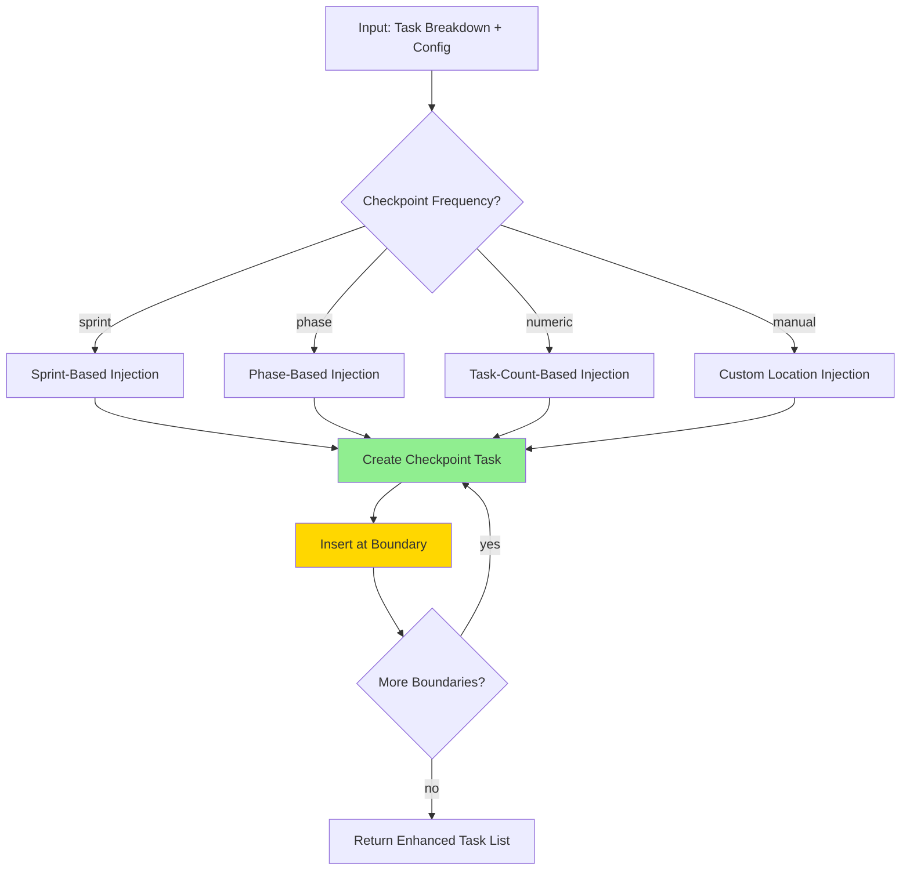

# Checkpoint Injection Algorithm Specification

**Algorithm ID**: CHKPT-INJ-001
**Version**: 1.0.0
**Status**: Specification Complete
**Created**: December 2, 2025
**Related**: TRD-WORKFLOW-001, TASK-005
**Dependencies**:
- `prd-metadata.schema.json` (workflow configuration)
- `workflow-section.schema.json` (template variables)
- `commit-template.schema.json` (checkpoint task format)

---

## Purpose

Inject git checkpoint tasks at strategic points in TRD task breakdowns to guide developers toward incremental commits instead of monolithic changesets. This algorithm analyzes task structure and inserts checkpoint tasks based on configurable frequency patterns (sprint-based, phase-based, or task-count-based).

## Algorithm Overview

### High-Level Flow



### Complexity Analysis

- **Time Complexity**: O(n) where n = total task count
- **Space Complexity**: O(m) where m = number of checkpoints (typically n/5 to n/10)
- **Performance Target**: <500ms per checkpoint injection for 100-task TRD

---

## Core Algorithm

### Pseudo-Code

```javascript
/**
 * Inject checkpoint tasks into TRD task breakdown
 * @param {Object} taskBreakdown - Structured task breakdown (phases > sprints > tasks)
 * @param {Object} config - Workflow configuration from PRD metadata
 * @returns {Object} Enhanced task breakdown with injected checkpoints
 */
function injectCheckpoints(taskBreakdown, config) {
  const checkpoints = [];
  const frequency = config.checkpoint_frequency || 'sprint';
  const trdId = config.trd_id;

  // Validate input
  if (!taskBreakdown || !taskBreakdown.phases) {
    throw new Error('Invalid task breakdown: missing phases structure');
  }

  // Route to appropriate injection strategy
  switch (frequency) {
    case 'sprint':
      checkpoints.push(...injectAtSprintBoundaries(taskBreakdown, trdId));
      break;
    case 'phase':
      checkpoints.push(...injectAtPhaseBoundaries(taskBreakdown, trdId));
      break;
    case 'manual':
      checkpoints.push(...injectAtCustomLocations(taskBreakdown, config, trdId));
      break;
    default:
      // Numeric frequency (e.g., every 5 tasks)
      if (typeof frequency === 'number' && frequency > 0) {
        checkpoints.push(...injectByTaskCount(taskBreakdown, frequency, trdId));
      } else {
        throw new Error(`Invalid checkpoint frequency: ${frequency}`);
      }
  }

  // Sort checkpoints by insertion order
  checkpoints.sort((a, b) => a.insertionIndex - b.insertionIndex);

  // Inject checkpoints into task breakdown (reverse order to maintain indices)
  for (let i = checkpoints.length - 1; i >= 0; i--) {
    const checkpoint = checkpoints[i];
    insertCheckpoint(taskBreakdown, checkpoint);
  }

  return {
    taskBreakdown,
    checkpoints: checkpoints.map(c => c.task),
    metrics: {
      totalCheckpoints: checkpoints.length,
      frequency,
      coverage: calculateCoverage(taskBreakdown, checkpoints)
    }
  };
}
```

---

## Injection Strategies

### 1. Sprint-Based Injection

**Use Case**: Default strategy for well-structured TRDs with clear sprint boundaries

**Algorithm**:
```javascript
function injectAtSprintBoundaries(taskBreakdown, trdId) {
  const checkpoints = [];
  let checkpointCounter = 1;

  taskBreakdown.phases.forEach((phase, phaseIndex) => {
    phase.sprints.forEach((sprint, sprintIndex) => {
      // Skip empty sprints
      if (!sprint.tasks || sprint.tasks.length === 0) {
        return;
      }

      // Collect task IDs completed in this sprint
      const completedTasks = sprint.tasks.map(t => t.id);

      // Create checkpoint task
      const checkpoint = createCheckpointTask({
        id: `TASK-CHKPT-${String(checkpointCounter).padStart(3, '0')}`,
        type: 'checkpoint',
        trigger: 'sprint',
        sprintNumber: sprintIndex + 1,
        phaseNumber: phaseIndex + 1,
        phaseName: phase.name,
        sprintName: sprint.name,
        completedTasks,
        trdId,
        taskCount: completedTasks.length
      });

      // Mark insertion point (at end of sprint)
      checkpoints.push({
        task: checkpoint,
        phaseIndex,
        sprintIndex,
        insertionIndex: sprint.tasks.length, // append to sprint
        location: 'sprint-end'
      });

      checkpointCounter++;
    });
  });

  return checkpoints;
}
```

**Edge Cases**:
- **Empty Sprint**: Skip checkpoint injection
- **Single-Task Sprint**: Still inject checkpoint for consistency
- **Final Sprint**: Always inject checkpoint (serves as phase boundary)

### 2. Phase-Based Injection

**Use Case**: High-level TRDs where sprints are not well-defined

**Algorithm**:
```javascript
function injectAtPhaseBoundaries(taskBreakdown, trdId) {
  const checkpoints = [];
  let checkpointCounter = 1;

  taskBreakdown.phases.forEach((phase, phaseIndex) => {
    // Collect all task IDs in this phase
    const completedTasks = [];
    phase.sprints.forEach(sprint => {
      if (sprint.tasks) {
        completedTasks.push(...sprint.tasks.map(t => t.id));
      }
    });

    // Skip empty phases
    if (completedTasks.length === 0) {
      return;
    }

    // Create phase checkpoint
    const checkpoint = createCheckpointTask({
      id: `TASK-CHKPT-${String(checkpointCounter).padStart(3, '0')}`,
      type: 'checkpoint',
      trigger: 'phase',
      phaseNumber: phaseIndex + 1,
      phaseName: phase.name,
      completedTasks,
      trdId,
      taskCount: completedTasks.length
    });

    // Insert at end of last sprint in phase
    const lastSprintIndex = phase.sprints.length - 1;
    checkpoints.push({
      task: checkpoint,
      phaseIndex,
      sprintIndex: lastSprintIndex,
      insertionIndex: phase.sprints[lastSprintIndex].tasks.length,
      location: 'phase-end'
    });

    checkpointCounter++;
  });

  return checkpoints;
}
```

**Edge Cases**:
- **Empty Phase**: Skip checkpoint injection
- **Single-Phase TRD**: Still inject checkpoint at end
- **Phase Without Sprints**: Create single "default sprint" container

### 3. Task-Count-Based Injection

**Use Case**: TRDs without clear phase/sprint structure or very granular checkpoint requirements

**Algorithm**:
```javascript
function injectByTaskCount(taskBreakdown, frequency, trdId) {
  const checkpoints = [];
  let checkpointCounter = 1;
  let taskCounter = 0;
  let accumulatedTasks = [];

  taskBreakdown.phases.forEach((phase, phaseIndex) => {
    phase.sprints.forEach((sprint, sprintIndex) => {
      if (!sprint.tasks) return;

      sprint.tasks.forEach((task, taskIndex) => {
        taskCounter++;
        accumulatedTasks.push(task.id);

        // Inject checkpoint every N tasks
        if (taskCounter % frequency === 0) {
          const checkpoint = createCheckpointTask({
            id: `TASK-CHKPT-${String(checkpointCounter).padStart(3, '0')}`,
            type: 'checkpoint',
            trigger: 'task-count',
            frequency,
            taskRange: {
              start: taskCounter - frequency + 1,
              end: taskCounter
            },
            completedTasks: [...accumulatedTasks],
            trdId,
            taskCount: accumulatedTasks.length
          });

          checkpoints.push({
            task: checkpoint,
            phaseIndex,
            sprintIndex,
            insertionIndex: taskIndex + 1, // insert after current task
            location: 'task-count'
          });

          checkpointCounter++;
          accumulatedTasks = []; // reset accumulator
        }
      });
    });
  });

  // Handle remaining tasks (if total tasks not divisible by frequency)
  if (accumulatedTasks.length > 0) {
    const lastPhase = taskBreakdown.phases[taskBreakdown.phases.length - 1];
    const lastSprint = lastPhase.sprints[lastPhase.sprints.length - 1];

    const checkpoint = createCheckpointTask({
      id: `TASK-CHKPT-${String(checkpointCounter).padStart(3, '0')}`,
      type: 'checkpoint',
      trigger: 'task-count-final',
      completedTasks: accumulatedTasks,
      trdId,
      taskCount: accumulatedTasks.length
    });

    checkpoints.push({
      task: checkpoint,
      phaseIndex: taskBreakdown.phases.length - 1,
      sprintIndex: lastPhase.sprints.length - 1,
      insertionIndex: lastSprint.tasks.length,
      location: 'final'
    });
  }

  return checkpoints;
}
```

**Edge Cases**:
- **Frequency Larger Than Total Tasks**: Single checkpoint at end
- **Remainder Tasks**: Always inject final checkpoint for remaining tasks
- **Frequency = 1**: Checkpoint after every task (not recommended, but supported)

### 4. Manual/Custom Location Injection

**Use Case**: PRD specifies custom checkpoint locations via metadata

**Algorithm**:
```javascript
function injectAtCustomLocations(taskBreakdown, config, trdId) {
  const checkpoints = [];
  const customLocations = config.git_workflow?.checkpoint_strategy?.custom_checkpoints || [];

  if (customLocations.length === 0) {
    // Fallback to sprint-based if no custom locations specified
    return injectAtSprintBoundaries(taskBreakdown, trdId);
  }

  customLocations.forEach((location, index) => {
    // Find task by ID
    const taskLocation = findTaskById(taskBreakdown, location.after_task);

    if (!taskLocation) {
      console.warn(`Custom checkpoint location not found: ${location.after_task}`);
      return;
    }

    // Collect tasks up to this point
    const completedTasks = collectTasksUpTo(taskBreakdown, taskLocation);

    const checkpoint = createCheckpointTask({
      id: `TASK-CHKPT-${String(index + 1).padStart(3, '0')}`,
      type: 'checkpoint',
      trigger: 'manual',
      afterTask: location.after_task,
      description: location.description,
      completedTasks: completedTasks.map(t => t.id),
      trdId,
      taskCount: completedTasks.length
    });

    checkpoints.push({
      task: checkpoint,
      phaseIndex: taskLocation.phaseIndex,
      sprintIndex: taskLocation.sprintIndex,
      insertionIndex: taskLocation.taskIndex + 1,
      location: 'custom'
    });
  });

  return checkpoints;
}
```

**Edge Cases**:
- **Invalid Task ID**: Log warning and skip checkpoint
- **Duplicate Locations**: Allow multiple checkpoints at same location
- **Out-of-Order Locations**: Sort by task order before injection

---

## Checkpoint Task Structure

### Task Template

```javascript
function createCheckpointTask(params) {
  const {
    id,
    type,
    trigger,
    completedTasks,
    trdId,
    taskCount,
    ...metadata
  } = params;

  return {
    id,
    type,
    title: generateCheckpointTitle(metadata),
    description: generateCheckpointDescription(metadata, completedTasks),
    duration: '0.5 hours', // Checkpoints are quick
    priority: 'high',
    dependencies: completedTasks,
    acceptance_criteria: [
      'All completed tasks committed with conventional commit messages',
      'Commit messages reference TRD ID and task IDs',
      'Branch is up to date with latest changes',
      'Tests are passing (if applicable to completed tasks)'
    ],
    commit_template: generateCommitTemplate(metadata, completedTasks, trdId),
    metadata: {
      ...metadata,
      trigger,
      taskCount,
      trdId
    }
  };
}

function generateCheckpointTitle(metadata) {
  if (metadata.trigger === 'sprint') {
    return `Git Checkpoint - Sprint ${metadata.sprintNumber} Complete`;
  } else if (metadata.trigger === 'phase') {
    return `Git Checkpoint - ${metadata.phaseName} Complete`;
  } else if (metadata.trigger === 'task-count') {
    return `Git Checkpoint - Tasks ${metadata.taskRange.start}-${metadata.taskRange.end}`;
  } else if (metadata.trigger === 'manual') {
    return `Git Checkpoint - ${metadata.description || 'Custom Checkpoint'}`;
  }
  return 'Git Checkpoint';
}

function generateCheckpointDescription(metadata, completedTasks) {
  const taskList = completedTasks.slice(0, 10).join(', ');
  const more = completedTasks.length > 10 ? ` and ${completedTasks.length - 10} more` : '';

  return `Create incremental git commit for completed tasks: ${taskList}${more}.

**Commit Guidelines**:
- Use conventional commit format: \`type(scope): subject\`
- Reference TRD ID in commit footer
- List all completed task IDs
- Keep subject line under 72 characters
- Include brief description of what was accomplished

**Verification**:
- [ ] All files staged with \`git add\`
- [ ] Commit message follows template
- [ ] Tests passing (if applicable)
- [ ] Branch is clean (\`git status\`)`;
}

function generateCommitTemplate(metadata, completedTasks, trdId) {
  const type = inferCommitType(completedTasks);
  const scope = metadata.phaseName ? kebabCase(metadata.phaseName) : 'trd';

  return {
    type,
    scope,
    subject: `complete ${metadata.sprintName || 'checkpoint'}`,
    body: `Completed tasks:\n${completedTasks.map(t => `- ${t}`).join('\n')}`,
    footer: `Related: ${trdId}${metadata.sprintNumber ? `, Sprint ${metadata.sprintNumber}` : ''}`
  };
}
```

---

## Edge Case Handling

### Edge Case 1: Single Task TRD

**Scenario**: TRD contains only 1 task

**Handling**:
```javascript
if (totalTasks === 1) {
  // Inject single checkpoint at end
  return injectAtPhaseBoundaries(taskBreakdown, trdId);
}
```

**Rationale**: Even single-task TRDs benefit from commit guidance

### Edge Case 2: 100+ Task TRD

**Scenario**: Very large TRD with 100+ tasks

**Handling**:
```javascript
if (totalTasks > 100) {
  // Use task-count-based injection with frequency = 10
  const frequency = Math.ceil(totalTasks / 10); // aim for ~10 checkpoints
  return injectByTaskCount(taskBreakdown, frequency, trdId);
}
```

**Rationale**: Avoid overwhelming developers with too many checkpoints (max ~10-15 recommended)

### Edge Case 3: No Sprint Structure

**Scenario**: TRD has phases but no sprints defined

**Handling**:
```javascript
function normalizeTaskBreakdown(taskBreakdown) {
  taskBreakdown.phases.forEach(phase => {
    if (!phase.sprints || phase.sprints.length === 0) {
      // Create default sprint containing all phase tasks
      phase.sprints = [{
        name: `${phase.name} - All Tasks`,
        tasks: phase.tasks || []
      }];
      delete phase.tasks; // move to sprint structure
    }
  });
  return taskBreakdown;
}
```

**Rationale**: Normalize structure before injection for consistent processing

### Edge Case 4: Uneven Sprint Sizes

**Scenario**: Sprints have vastly different task counts (e.g., 2, 15, 3, 20)

**Handling**:
```javascript
function injectAtSprintBoundaries(taskBreakdown, trdId) {
  // Standard sprint-based injection
  // Checkpoint after each sprint regardless of size
  // Rationale: Sprint boundaries represent logical work units
}
```

**Rationale**: Sprint boundaries are meaningful regardless of task count; maintain consistency

### Edge Case 5: Empty Phases/Sprints

**Scenario**: Phase or sprint contains no tasks

**Handling**:
```javascript
if (!sprint.tasks || sprint.tasks.length === 0) {
  console.log(`Skipping checkpoint for empty ${sprint.name}`);
  return; // skip checkpoint
}
```

**Rationale**: No work = no checkpoint needed

### Edge Case 6: Checkpoint Frequency Larger Than Total Tasks

**Scenario**: frequency = 10, but only 5 tasks total

**Handling**:
```javascript
if (frequency >= totalTasks) {
  // Single checkpoint at end
  return injectAtPhaseBoundaries(taskBreakdown, trdId);
}
```

**Rationale**: Fall back to phase-based for logical checkpoint placement

---

## Performance Considerations

### Optimization Strategies

1. **Single Pass Traversal**: Process task tree once, collecting checkpoint locations
2. **Lazy Checkpoint Creation**: Only create checkpoint objects when needed
3. **In-Place Modification**: Modify task breakdown in place to avoid deep clones
4. **Index Calculation**: Pre-calculate insertion indices to avoid list reordering

### Performance Metrics

| TRD Size | Total Tasks | Checkpoints | Expected Time | Memory Usage |
|----------|-------------|-------------|---------------|--------------|
| Small    | 1-20        | 1-4         | <50ms         | <100KB       |
| Medium   | 21-50       | 5-10        | <200ms        | <500KB       |
| Large    | 51-100      | 10-15       | <500ms        | <1MB         |
| X-Large  | 100+        | 15-20       | <1000ms       | <2MB         |

### Complexity Analysis

- **Best Case**: O(n) - Single pass through all tasks
- **Worst Case**: O(n log n) - Sorting checkpoints + insertion
- **Average Case**: O(n) - Linear traversal dominates
- **Space**: O(m) where m = number of checkpoints (typically n/5 to n/10)

---

## Testing Strategy

### Unit Tests

```javascript
describe('Checkpoint Injection Algorithm', () => {
  it('should inject checkpoints at sprint boundaries', () => {
    const taskBreakdown = createSampleTRD(3, 5); // 3 phases, 5 sprints each
    const result = injectCheckpoints(taskBreakdown, { checkpoint_frequency: 'sprint' });
    expect(result.checkpoints.length).toBe(15); // 5 sprints × 3 phases
  });

  it('should inject checkpoints at phase boundaries', () => {
    const taskBreakdown = createSampleTRD(3, 5);
    const result = injectCheckpoints(taskBreakdown, { checkpoint_frequency: 'phase' });
    expect(result.checkpoints.length).toBe(3); // 3 phases
  });

  it('should inject checkpoints every N tasks', () => {
    const taskBreakdown = createSampleTRD(2, 3, 10); // 2 phases, 3 sprints, 10 tasks/sprint
    const result = injectCheckpoints(taskBreakdown, { checkpoint_frequency: 5 });
    expect(result.checkpoints.length).toBe(12); // 60 tasks / 5 = 12 checkpoints
  });

  it('should handle single task TRD', () => {
    const taskBreakdown = createSampleTRD(1, 1, 1);
    const result = injectCheckpoints(taskBreakdown, { checkpoint_frequency: 'sprint' });
    expect(result.checkpoints.length).toBe(1);
  });

  it('should handle 100+ task TRD efficiently', () => {
    const taskBreakdown = createSampleTRD(5, 20, 1); // 100 tasks
    const start = performance.now();
    const result = injectCheckpoints(taskBreakdown, { checkpoint_frequency: 'sprint' });
    const duration = performance.now() - start;
    expect(duration).toBeLessThan(500); // <500ms requirement
    expect(result.checkpoints.length).toBeLessThan(20); // reasonable checkpoint count
  });

  it('should skip empty sprints', () => {
    const taskBreakdown = {
      phases: [{
        name: 'Phase 1',
        sprints: [
          { name: 'Sprint 1', tasks: [{ id: 'TASK-001' }] },
          { name: 'Sprint 2', tasks: [] }, // empty
          { name: 'Sprint 3', tasks: [{ id: 'TASK-002' }] }
        ]
      }]
    };
    const result = injectCheckpoints(taskBreakdown, { checkpoint_frequency: 'sprint' });
    expect(result.checkpoints.length).toBe(2); // skip empty sprint
  });
});
```

### Integration Tests

```javascript
describe('Checkpoint Injection Integration', () => {
  it('should integrate with workflow generator', () => {
    const prd = loadPRDWithMetadata('sample-prd.md');
    const trd = generateTRDFromPRD(prd); // includes checkpoint injection
    expect(trd).toHaveProperty('git_workflow');
    expect(trd.phases[0].sprints[0].tasks).toContainEqual(
      expect.objectContaining({ type: 'checkpoint' })
    );
  });

  it('should respect PRD metadata configuration', () => {
    const prd = {
      metadata: { workflow: { checkpoint_frequency: 10 } },
      content: '...'
    };
    const trd = generateTRDFromPRD(prd);
    const checkpoints = trd.phases.flatMap(p =>
      p.sprints.flatMap(s =>
        s.tasks.filter(t => t.type === 'checkpoint')
      )
    );
    expect(checkpoints.length).toBeGreaterThan(0);
    expect(checkpoints[0].metadata.trigger).toBe('task-count');
  });
});
```

---

## Configuration Reference

### PRD Metadata Configuration

```yaml
workflow:
  checkpoint_frequency: sprint  # Options: 'sprint' | 'phase' | 'manual' | number
  git_workflow:
    checkpoint_strategy:
      auto_checkpoint: true
      checkpoint_after_sprint: true
      checkpoint_after_phase: true
      custom_checkpoints:
        - after_task: TASK-015
          description: "Checkpoint after database schema changes"
        - after_task: TASK-030
          description: "Checkpoint after API implementation"
```

### Default Configuration

```javascript
const DEFAULT_CONFIG = {
  checkpoint_frequency: 'sprint',
  git_workflow: {
    checkpoint_strategy: {
      auto_checkpoint: true,
      checkpoint_after_sprint: true,
      checkpoint_after_phase: true,
      custom_checkpoints: []
    }
  }
};
```

---

## References

- **TRD-WORKFLOW-001**: Parent TRD specification
- **prd-metadata.schema.json**: Workflow configuration schema
- **commit-template.schema.json**: Checkpoint commit template format
- **Git Workflow Agent**: Agent responsible for executing checkpoint commits
- **Conventional Commits**: https://www.conventionalcommits.org/

---

## Revision History

| Version | Date | Author | Changes |
|---------|------|--------|---------|
| 1.0.0 | 2025-12-02 | Fortium Team | Initial specification with complete algorithm design |

---

_Algorithm Specification Complete - Ready for Implementation (TASK-009)_
