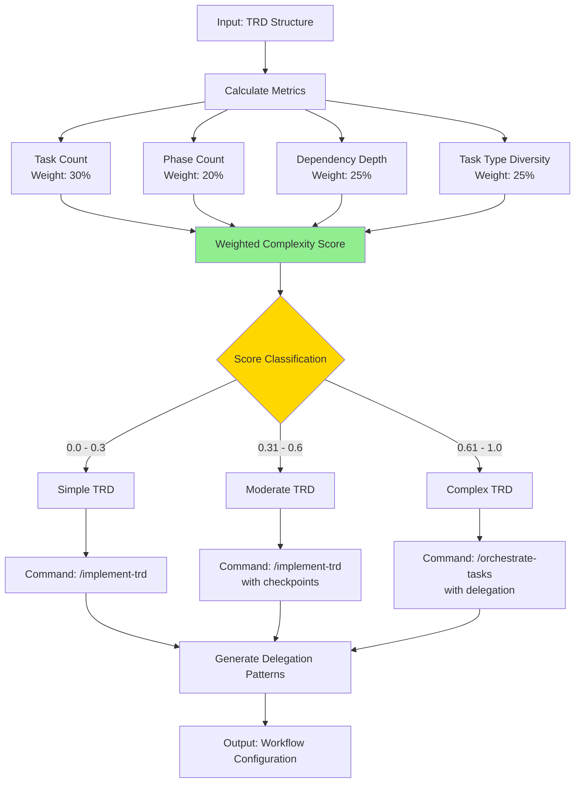
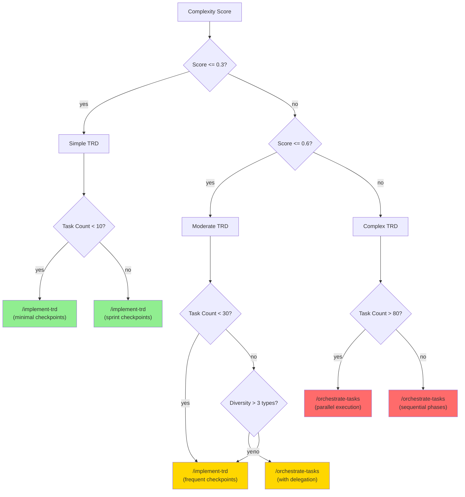

# Workflow Complexity Assessment Algorithm Specification

**Algorithm ID**: WF-COMPLEX-001
**Version**: 1.0.0
**Status**: Specification Complete
**Created**: December 2, 2025
**Related**: TRD-WORKFLOW-001, TASK-007
**Dependencies**:
- `task-type-detection.md` (task type classification)
- `workflow-section.schema.json` (workflow template structure)
- `prd-metadata.schema.json` (execution command configuration)

---

## Purpose

Assess TRD workflow complexity to recommend appropriate execution commands (`/implement-trd` for simple TRDs, `/orchestrate-tasks` for complex TRDs) and generate optimal delegation patterns. This algorithm analyzes task count, phase structure, dependency depth, and task type diversity to produce a complexity score and actionable workflow recommendations.

## Algorithm Overview

### High-Level Flow



### Complexity Categories

| Category | Score Range | Task Count | Phase Count | Recommended Command |
|----------|-------------|------------|-------------|---------------------|
| **Simple** | 0.0 - 0.3 | 1-20 | 1-2 | `/implement-trd` |
| **Moderate** | 0.31 - 0.6 | 21-50 | 3-4 | `/implement-trd` with frequent checkpoints |
| **Complex** | 0.61 - 1.0 | 51+ | 5+ | `/orchestrate-tasks` with delegation |

---

## Core Algorithm

### Main Assessment Function

```javascript
/**
 * Assess TRD workflow complexity and generate recommendations
 * @param {Object} trd - Complete TRD structure with tasks, phases, dependencies
 * @param {Object} taskTypes - Task type classifications from TASK-TYPE-001
 * @param {Object} options - Assessment options and thresholds
 * @returns {Object} Complexity assessment with recommendations
 */
function assessWorkflowComplexity(trd, taskTypes, options = {}) {
  const {
    weights = DEFAULT_WEIGHTS,
    thresholds = DEFAULT_THRESHOLDS
  } = options;

  // Calculate individual complexity metrics
  const metrics = {
    taskCount: calculateTaskCountScore(trd, weights.taskCount),
    phaseCount: calculatePhaseCountScore(trd, weights.phaseCount),
    dependencyDepth: calculateDependencyDepthScore(trd, weights.dependencyDepth),
    taskTypeDiversity: calculateTaskTypeDiversityScore(taskTypes, weights.taskTypeDiversity)
  };

  // Calculate weighted overall complexity score
  const complexityScore = Object.values(metrics).reduce((sum, metric) =>
    sum + (metric.score * metric.weight), 0
  );

  // Classify complexity level
  const complexityLevel = classifyComplexity(complexityScore, thresholds);

  // Select execution command
  const executionCommand = selectExecutionCommand(complexityLevel, metrics, trd);

  // Generate delegation patterns
  const delegationPatterns = generateDelegationPatterns(taskTypes, complexityLevel, trd);

  // Generate recommended approach
  const recommendedApproach = generateExecutionApproach(complexityLevel, metrics, trd);

  // Generate quality gates
  const qualityGates = generateQualityGates(complexityLevel, taskTypes, trd);

  return {
    complexityScore,
    complexityLevel,
    metrics,
    recommendations: {
      executionCommand,
      approach: recommendedApproach,
      delegationPatterns,
      qualityGates
    },
    analysis: {
      totalTasks: trd.totalTasks,
      totalPhases: trd.phases.length,
      maxDependencyDepth: metrics.dependencyDepth.maxDepth,
      uniqueTaskTypes: metrics.taskTypeDiversity.uniqueTypes
    }
  };
}

const DEFAULT_WEIGHTS = {
  taskCount: 0.30,
  phaseCount: 0.20,
  dependencyDepth: 0.25,
  taskTypeDiversity: 0.25
};

const DEFAULT_THRESHOLDS = {
  simple: 0.3,
  moderate: 0.6,
  complex: 1.0
};
```

---

## Complexity Metrics

### 1. Task Count Score (Weight: 30%)

**Purpose**: Larger TRDs require more coordination and orchestration

**Algorithm**:
```javascript
function calculateTaskCountScore(trd, weight) {
  const taskCount = trd.totalTasks || countTasks(trd);

  // Score curve: logarithmic scaling for task count
  let score;
  if (taskCount <= 20) {
    // Simple: linear 0.0 - 0.3
    score = (taskCount / 20) * 0.3;
  } else if (taskCount <= 50) {
    // Moderate: linear 0.3 - 0.6
    score = 0.3 + ((taskCount - 20) / 30) * 0.3;
  } else {
    // Complex: logarithmic 0.6 - 1.0
    const overflow = taskCount - 50;
    score = 0.6 + Math.min(0.4, Math.log10(overflow + 1) / 2.5);
  }

  return {
    score,
    weight,
    value: taskCount,
    category: categorizeTaskCount(taskCount),
    rationale: `${taskCount} tasks ${getRationale(taskCount)}`
  };
}

function categorizeTaskCount(count) {
  if (count <= 20) return 'small';
  if (count <= 50) return 'medium';
  if (count <= 100) return 'large';
  return 'x-large';
}

function getRationale(count) {
  if (count <= 10) return '- minimal coordination needed';
  if (count <= 20) return '- manageable with linear execution';
  if (count <= 50) return '- benefits from checkpoint structure';
  if (count <= 100) return '- requires orchestration for efficiency';
  return '- complex orchestration essential';
}
```

**Score Examples**:
- 5 tasks → 0.075 (simple)
- 20 tasks → 0.3 (simple/moderate boundary)
- 35 tasks → 0.45 (moderate)
- 60 tasks → 0.7 (complex)
- 100 tasks → 0.85 (very complex)

### 2. Phase Count Score (Weight: 20%)

**Purpose**: Multiple phases indicate architectural complexity and coordination needs

**Algorithm**:
```javascript
function calculatePhaseCountScore(trd, weight) {
  const phaseCount = trd.phases ? trd.phases.length : 1;

  // Score curve: more phases = more coordination
  let score;
  if (phaseCount <= 2) {
    // Simple: 1-2 phases
    score = (phaseCount - 1) * 0.15; // 0.0 (1 phase) to 0.15 (2 phases)
  } else if (phaseCount <= 4) {
    // Moderate: 3-4 phases
    score = 0.15 + ((phaseCount - 2) / 2) * 0.35; // 0.15 to 0.5
  } else {
    // Complex: 5+ phases
    score = 0.5 + Math.min(0.5, (phaseCount - 4) * 0.1); // 0.5 to 1.0
  }

  return {
    score,
    weight,
    value: phaseCount,
    category: categorizePhaseCount(phaseCount),
    rationale: `${phaseCount} phase${phaseCount > 1 ? 's' : ''} ${getPhaseRationale(phaseCount)}`
  };
}

function categorizePhaseCount(count) {
  if (count <= 2) return 'single-phase';
  if (count <= 4) return 'multi-phase';
  return 'complex-phase';
}

function getPhaseRationale(count) {
  if (count === 1) return '- single development cycle';
  if (count <= 2) return '- minimal phase transitions';
  if (count <= 4) return '- structured phase gates needed';
  return '- complex phase orchestration required';
}
```

**Score Examples**:
- 1 phase → 0.0 (simple)
- 2 phases → 0.15 (simple)
- 3 phases → 0.325 (moderate)
- 5 phases → 0.6 (complex)
- 8 phases → 0.9 (very complex)

### 3. Dependency Depth Score (Weight: 25%)

**Purpose**: Deep dependency chains require careful sequencing and increase complexity

**Algorithm**:
```javascript
function calculateDependencyDepthScore(trd, weight) {
  // Build dependency graph
  const graph = buildDependencyGraph(trd);

  // Calculate max depth using topological sort
  const depths = calculateTaskDepths(graph);
  const maxDepth = Math.max(...Object.values(depths));

  // Calculate average depth
  const avgDepth = Object.values(depths).reduce((a, b) => a + b, 0) / Object.keys(depths).length;

  // Score based on max depth with avg depth modifier
  let score;
  if (maxDepth <= 2) {
    // Simple: shallow dependencies
    score = maxDepth * 0.1; // 0.0 to 0.2
  } else if (maxDepth <= 5) {
    // Moderate: some dependency chains
    score = 0.2 + ((maxDepth - 2) / 3) * 0.3; // 0.2 to 0.5
  } else {
    // Complex: deep dependency chains
    score = 0.5 + Math.min(0.5, (maxDepth - 5) * 0.08); // 0.5 to 1.0
  }

  // Adjust for average depth (high avg depth increases complexity)
  const avgDepthBonus = avgDepth > 2 ? Math.min(0.15, (avgDepth - 2) * 0.05) : 0;
  score = Math.min(1.0, score + avgDepthBonus);

  return {
    score,
    weight,
    maxDepth,
    avgDepth: avgDepth.toFixed(2),
    category: categorizeDepth(maxDepth),
    rationale: `Max depth ${maxDepth}, avg ${avgDepth.toFixed(1)} ${getDepthRationale(maxDepth)}`
  };
}

function buildDependencyGraph(trd) {
  const graph = {};

  trd.phases.forEach(phase => {
    phase.sprints.forEach(sprint => {
      sprint.tasks.forEach(task => {
        graph[task.id] = {
          dependencies: task.dependencies || [],
          task
        };
      });
    });
  });

  return graph;
}

function calculateTaskDepths(graph) {
  const depths = {};
  const visited = new Set();

  function dfs(taskId, depth = 0) {
    if (visited.has(taskId)) {
      return depths[taskId];
    }

    visited.add(taskId);
    const node = graph[taskId];

    if (!node || !node.dependencies || node.dependencies.length === 0) {
      depths[taskId] = 0;
      return 0;
    }

    const maxDepDep = Math.max(
      ...node.dependencies.map(depId => dfs(depId, depth + 1))
    );

    depths[taskId] = maxDepDep + 1;
    return depths[taskId];
  }

  Object.keys(graph).forEach(taskId => dfs(taskId));

  return depths;
}

function categorizeDepth(depth) {
  if (depth <= 2) return 'shallow';
  if (depth <= 5) return 'moderate';
  if (depth <= 8) return 'deep';
  return 'very-deep';
}

function getDepthRationale(depth) {
  if (depth <= 2) return '- minimal sequencing constraints';
  if (depth <= 5) return '- some sequential dependencies';
  if (depth <= 8) return '- significant dependency chains';
  return '- complex dependency management needed';
}
```

**Score Examples**:
- Max depth 1 → 0.1 (simple)
- Max depth 3 → 0.3 (moderate)
- Max depth 5 → 0.5 (moderate/complex boundary)
- Max depth 8 → 0.74 (complex)
- Max depth 10+ → 0.9+ (very complex)

### 4. Task Type Diversity Score (Weight: 25%)

**Purpose**: High diversity requires multi-agent orchestration and specialized expertise

**Algorithm**:
```javascript
function calculateTaskTypeDiversityScore(taskTypes, weight) {
  // Count unique task types (excluding 'general')
  const typeDistribution = {};
  Object.values(taskTypes).forEach(classification => {
    const type = classification.primaryType;
    if (type && type !== 'general') {
      typeDistribution[type] = (typeDistribution[type] || 0) + 1;
    }
  });

  const uniqueTypes = Object.keys(typeDistribution);
  const totalTasks = Object.values(typeDistribution).reduce((a, b) => a + b, 0);

  // Calculate entropy (diversity measure)
  let entropy = 0;
  Object.values(typeDistribution).forEach(count => {
    const probability = count / totalTasks;
    entropy -= probability * Math.log2(probability);
  });

  // Normalize entropy to [0, 1]
  const maxEntropy = Math.log2(6); // log2(number of task types)
  const normalizedEntropy = maxEntropy > 0 ? entropy / maxEntropy : 0;

  // Score based on unique types and distribution balance
  let score;
  if (uniqueTypes.length <= 2) {
    // Simple: 1-2 types (single domain)
    score = uniqueTypes.length * 0.15; // 0.15 to 0.3
  } else if (uniqueTypes.length <= 4) {
    // Moderate: 3-4 types (multi-domain)
    score = 0.3 + ((uniqueTypes.length - 2) / 2) * 0.3; // 0.3 to 0.6
  } else {
    // Complex: 5+ types (cross-domain)
    score = 0.6 + Math.min(0.4, (uniqueTypes.length - 4) * 0.1); // 0.6 to 1.0
  }

  // Bonus for balanced distribution (high entropy)
  const balanceBonus = normalizedEntropy * 0.2;
  score = Math.min(1.0, score + balanceBonus);

  return {
    score,
    weight,
    uniqueTypes: uniqueTypes.length,
    distribution: typeDistribution,
    entropy: normalizedEntropy.toFixed(2),
    category: categorizeDiversity(uniqueTypes.length),
    rationale: `${uniqueTypes.length} task type${uniqueTypes.length > 1 ? 's' : ''} ${getDiversityRationale(uniqueTypes.length)}`
  };
}

function categorizeDiversity(count) {
  if (count <= 2) return 'single-domain';
  if (count <= 4) return 'multi-domain';
  return 'cross-domain';
}

function getDiversityRationale(count) {
  if (count === 1) return '- single specialist sufficient';
  if (count === 2) return '- minimal agent coordination';
  if (count <= 4) return '- multi-agent delegation beneficial';
  return '- complex agent orchestration required';
}
```

**Score Examples**:
- 1 type (all backend) → 0.15 (simple)
- 2 types (backend + frontend) → 0.3 (simple/moderate)
- 3 types → 0.45 (moderate)
- 5 types → 0.7 (complex)
- 6+ types (all categories) → 0.9+ (very complex)

---

## Complexity Classification

### Classification Function

```javascript
function classifyComplexity(score, thresholds) {
  if (score <= thresholds.simple) {
    return {
      level: 'simple',
      label: 'Simple TRD',
      description: 'Straightforward implementation with minimal coordination',
      color: '#90EE90' // green
    };
  } else if (score <= thresholds.moderate) {
    return {
      level: 'moderate',
      label: 'Moderate TRD',
      description: 'Structured implementation with checkpoint management',
      color: '#FFD700' // yellow
    };
  } else {
    return {
      level: 'complex',
      label: 'Complex TRD',
      description: 'Orchestrated implementation with multi-agent delegation',
      color: '#FF6B6B' // red
    };
  }
}
```

---

## Command Selection

### Decision Tree



### Command Selection Algorithm

```javascript
function selectExecutionCommand(complexityLevel, metrics, trd) {
  const taskCount = metrics.taskCount.value;
  const diversity = metrics.taskTypeDiversity.uniqueTypes;
  const maxDepth = metrics.dependencyDepth.maxDepth;

  let command, reasoning, alternatives;

  if (complexityLevel.level === 'simple') {
    command = '/implement-trd';
    reasoning = [
      'Low task count supports linear implementation',
      'Minimal coordination overhead',
      'Single-agent execution efficient'
    ];
    alternatives = [];

    // Adjust checkpoint frequency
    if (taskCount < 10) {
      reasoning.push('Use minimal checkpoints (phase-based)');
    } else {
      reasoning.push('Use sprint-based checkpoints');
    }

  } else if (complexityLevel.level === 'moderate') {
    // Default to /implement-trd but consider orchestration
    if (diversity > 3 && taskCount > 30) {
      command = '/orchestrate-tasks';
      reasoning = [
        'Task diversity benefits from specialized agents',
        'Parallel execution possible for independent tasks',
        'Orchestration reduces overall execution time'
      ];
      alternatives = [
        {
          command: '/implement-trd',
          reason: 'If preferring sequential execution with detailed checkpoints'
        }
      ];
    } else {
      command = '/implement-trd';
      reasoning = [
        'Manageable complexity for single-agent execution',
        'Frequent checkpoints recommended',
        'Clear sprint boundaries guide progress'
      ];
      alternatives = [
        {
          command: '/orchestrate-tasks',
          reason: 'If team capacity allows parallel workstreams'
        }
      ];
    }

  } else { // complex
    command = '/orchestrate-tasks';
    reasoning = [
      'High complexity requires orchestration',
      'Multi-agent delegation essential for efficiency',
      'Parallel execution maximizes throughput'
    ];

    if (taskCount > 80) {
      reasoning.push('Large task count: parallel phase execution recommended');
    } else {
      reasoning.push('Moderate task count: sequential phases with parallel tasks');
    }

    if (maxDepth > 5) {
      reasoning.push('Deep dependencies: careful sequencing required');
    }

    alternatives = [];
  }

  return {
    primary: command,
    reasoning,
    alternatives,
    checkpointStrategy: determineCheckpointStrategy(complexityLevel, metrics),
    parallelismRecommendation: determineParallelism(complexityLevel, metrics, trd)
  };
}

function determineCheckpointStrategy(complexityLevel, metrics) {
  const taskCount = metrics.taskCount.value;

  if (complexityLevel.level === 'simple') {
    return taskCount < 10 ? 'phase' : 'sprint';
  } else if (complexityLevel.level === 'moderate') {
    return 'sprint';
  } else {
    return taskCount > 80 ? 5 : 'sprint'; // every 5 tasks for very large TRDs
  }
}

function determineParallelism(complexityLevel, metrics, trd) {
  if (complexityLevel.level === 'simple') {
    return {
      enabled: false,
      reason: 'Linear execution sufficient for simple TRDs'
    };
  }

  const maxDepth = metrics.dependencyDepth.maxDepth;
  const avgDepth = parseFloat(metrics.dependencyDepth.avgDepth);

  if (maxDepth <= 2) {
    return {
      enabled: true,
      strategy: 'aggressive',
      reason: 'Shallow dependencies allow extensive parallelism'
    };
  } else if (avgDepth < 3) {
    return {
      enabled: true,
      strategy: 'moderate',
      reason: 'Some tasks can execute in parallel within constraints'
    };
  } else {
    return {
      enabled: true,
      strategy: 'conservative',
      reason: 'Deep dependencies limit parallelism to independent subtrees'
    };
  }
}
```

---

## Delegation Pattern Generation

### Pattern Generator Algorithm

```javascript
function generateDelegationPatterns(taskTypes, complexityLevel, trd) {
  const patterns = [];

  // Group tasks by type
  const tasksByType = groupTasksByType(taskTypes);

  // Generate patterns based on complexity
  Object.entries(tasksByType).forEach(([type, tasks]) => {
    if (tasks.length === 0 || type === 'general') return;

    const agent = mapTypeToAgent(type);
    const pattern = {
      taskType: type,
      agent,
      taskCount: tasks.length,
      taskIds: tasks.map(t => t.id),
      strategy: determineExecutionStrategy(tasks, complexityLevel)
    };

    // Add pattern details
    if (complexityLevel.level === 'complex') {
      // Complex TRDs: detailed delegation with parallelism
      pattern.parallelizable = tasks.filter(t => canExecuteInParallel(t, tasks)).map(t => t.id);
      pattern.sequential = tasks.filter(t => !canExecuteInParallel(t, tasks)).map(t => t.id);
      pattern.estimatedDuration = estimateDuration(tasks);
    } else {
      // Simple/Moderate: basic delegation
      pattern.approach = 'sequential';
      pattern.checkpoints = determineCheckpointsForTasks(tasks, complexityLevel);
    }

    patterns.push(pattern);
  });

  // Sort by task count (descending) for prioritization
  patterns.sort((a, b) => b.taskCount - a.taskCount);

  // Add cross-agent coordination notes
  if (patterns.length > 1) {
    addCoordinationNotes(patterns, taskTypes, trd);
  }

  return {
    patterns,
    summary: generateDelegationSummary(patterns),
    coordinationRequired: patterns.length > 1
  };
}

function mapTypeToAgent(type) {
  const agentMap = {
    'infrastructure': 'infrastructure-developer',
    'security': 'backend-developer', // Security tasks often part of backend work
    'frontend': 'frontend-developer',
    'backend': 'backend-developer',
    'testing': 'test-runner',
    'documentation': 'documentation-specialist',
    'general': 'backend-developer' // Default to backend for general tasks
  };

  return agentMap[type] || 'backend-developer';
}

function determineExecutionStrategy(tasks, complexityLevel) {
  if (complexityLevel.level === 'simple') {
    return 'linear';
  } else if (complexityLevel.level === 'moderate') {
    return 'sequential-with-checkpoints';
  } else {
    return 'orchestrated-parallel';
  }
}

function canExecuteInParallel(task, allTasks) {
  // Check if task has dependencies within same type group
  if (!task.dependencies || task.dependencies.length === 0) {
    return true;
  }

  const taskIds = new Set(allTasks.map(t => t.id));
  const hasInternalDeps = task.dependencies.some(depId => taskIds.has(depId));

  return !hasInternalDeps;
}

function addCoordinationNotes(patterns, taskTypes, trd) {
  // Detect inter-type dependencies
  patterns.forEach(pattern => {
    pattern.coordinationNeeded = [];

    pattern.taskIds.forEach(taskId => {
      const task = findTaskById(trd, taskId);
      if (!task || !task.dependencies) return;

      task.dependencies.forEach(depId => {
        const depTask = findTaskById(trd, depId);
        if (!depTask) return;

        const depType = taskTypes[depId]?.primaryType;
        if (depType && depType !== pattern.taskType) {
          pattern.coordinationNeeded.push({
            task: taskId,
            dependsOn: depId,
            dependsOnType: depType,
            dependsOnAgent: mapTypeToAgent(depType)
          });
        }
      });
    });
  });
}

function generateDelegationSummary(patterns) {
  const totalTasks = patterns.reduce((sum, p) => sum + p.taskCount, 0);

  return {
    totalAgents: patterns.length,
    totalTasks,
    distribution: patterns.map(p => ({
      agent: p.agent,
      taskCount: p.taskCount,
      percentage: ((p.taskCount / totalTasks) * 100).toFixed(1) + '%'
    })),
    recommendation: patterns.length > 1
      ? 'Use /orchestrate-tasks for efficient multi-agent coordination'
      : 'Single agent sufficient - /implement-trd recommended'
  };
}
```

---

## Recommended Approach Generation

### Approach Generator

```javascript
function generateExecutionApproach(complexityLevel, metrics, trd) {
  const approach = {
    overview: '',
    phases: [],
    guidelines: [],
    warnings: []
  };

  if (complexityLevel.level === 'simple') {
    approach.overview = 'Linear implementation with sprint-based checkpoints. Single developer can execute sequentially.';
    approach.phases = [
      'Execute tasks in order within each sprint',
      'Create git checkpoint after each sprint',
      'Validate tests pass before moving to next sprint'
    ];
    approach.guidelines = [
      'Focus on one sprint at a time',
      'Commit frequently within sprints for incremental progress',
      'Run test suite after each logical milestone'
    ];

  } else if (complexityLevel.level === 'moderate') {
    approach.overview = 'Structured implementation with frequent checkpoints. Consider task grouping by type for efficiency.';
    approach.phases = [
      'Group related tasks by type (e.g., all API work, then frontend)',
      'Execute each group with appropriate specialist focus',
      'Create checkpoints after each sprint or every 5-10 tasks',
      'Run integration tests at phase boundaries'
    ];
    approach.guidelines = [
      'Parallelize independent task groups if team capacity allows',
      'Maintain clear handoffs between task types (e.g., API → Frontend)',
      'Use feature branches for each sprint or major task group',
      'Review and merge checkpoint commits frequently'
    ];
    approach.warnings = [
      `High task diversity (${metrics.taskTypeDiversity.uniqueTypes} types) - coordinate between specialists`,
      metrics.dependencyDepth.maxDepth > 4 ? 'Deep dependencies - verify prerequisites before starting tasks' : null
    ].filter(Boolean);

  } else { // complex
    approach.overview = 'Orchestrated multi-agent implementation with parallel execution. Requires careful coordination and delegation.';
    approach.phases = [
      'Delegate tasks to specialized agents based on type',
      'Execute independent tasks in parallel across phases',
      'Coordinate handoffs for cross-type dependencies',
      'Integrate and test at phase boundaries',
      'Final integration testing before completion'
    ];
    approach.guidelines = [
      'Use /orchestrate-tasks to manage multi-agent coordination',
      'Establish clear interfaces between parallel workstreams',
      'Schedule daily standups for dependency coordination',
      'Maintain integration branch for combining work',
      'Run comprehensive test suite at each phase gate'
    ];
    approach.warnings = [
      `Very high complexity (score: ${metrics.complexityScore.toFixed(2)}) - careful planning essential`,
      `${metrics.taskTypeDiversity.uniqueTypes} task types - requires ${metrics.taskTypeDiversity.uniqueTypes} specialized agents`,
      metrics.dependencyDepth.maxDepth > 6 ? 'Very deep dependencies - use critical path analysis' : null,
      trd.totalTasks > 80 ? 'Large task count - consider breaking into sub-projects' : null
    ].filter(Boolean);
  }

  return approach;
}
```

---

## Quality Gates Generation

### Quality Gate Generator

```javascript
function generateQualityGates(complexityLevel, taskTypes, trd) {
  const gates = {
    sprint: [],
    phase: [],
    final: []
  };

  // Sprint-level gates (all complexity levels)
  gates.sprint.push({
    name: 'Unit Tests Passing',
    type: 'test_coverage',
    threshold: 80,
    required: true,
    description: 'All unit tests for completed tasks must pass'
  });

  gates.sprint.push({
    name: 'Git Checkpoint Created',
    type: 'git_workflow',
    required: true,
    description: 'Incremental commit created with conventional format'
  });

  // Phase-level gates
  gates.phase.push({
    name: 'Integration Tests Passing',
    type: 'integration_test',
    threshold: 70,
    required: true,
    description: 'Integration tests for phase functionality must pass'
  });

  if (hasType(taskTypes, 'security')) {
    gates.phase.push({
      name: 'Security Scan',
      type: 'security_scan',
      required: true,
      description: 'No high-severity vulnerabilities detected'
    });
  }

  gates.phase.push({
    name: 'Code Review',
    type: 'code_review',
    required: complexityLevel.level !== 'simple',
    description: 'Peer review completed for phase deliverables'
  });

  // Final gates
  gates.final.push({
    name: 'Full Test Suite',
    type: 'test_coverage',
    threshold: 85,
    required: true,
    description: 'Complete test coverage across all implemented features'
  });

  if (hasType(taskTypes, 'frontend')) {
    gates.final.push({
      name: 'E2E Tests',
      type: 'e2e_test',
      required: complexityLevel.level === 'complex',
      description: 'End-to-end user flows validated'
    });
  }

  gates.final.push({
    name: 'Documentation Updated',
    type: 'documentation',
    required: true,
    description: 'README, API docs, and architecture docs current'
  });

  if (hasType(taskTypes, 'infrastructure')) {
    gates.final.push({
      name: 'Deployment Validation',
      type: 'deployment',
      required: true,
      description: 'Successful deployment to staging environment'
    });
  }

  return gates;
}

function hasType(taskTypes, targetType) {
  return Object.values(taskTypes).some(
    classification => classification.primaryType === targetType
  );
}
```

---

## Testing Strategy

### Unit Tests

```javascript
describe('Workflow Complexity Assessment', () => {
  it('should classify simple TRD correctly', () => {
    const trd = createSampleTRD({ tasks: 15, phases: 2, maxDepth: 2, types: 2 });
    const result = assessWorkflowComplexity(trd, mockTaskTypes);

    expect(result.complexityLevel.level).toBe('simple');
    expect(result.recommendations.executionCommand.primary).toBe('/implement-trd');
  });

  it('should classify complex TRD correctly', () => {
    const trd = createSampleTRD({ tasks: 70, phases: 6, maxDepth: 8, types: 5 });
    const result = assessWorkflowComplexity(trd, mockTaskTypes);

    expect(result.complexityLevel.level).toBe('complex');
    expect(result.recommendations.executionCommand.primary).toBe('/orchestrate-tasks');
  });

  it('should generate delegation patterns for multi-type TRD', () => {
    const trd = createSampleTRD({ tasks: 40, phases: 3, maxDepth: 4, types: 4 });
    const result = assessWorkflowComplexity(trd, mockTaskTypes);

    expect(result.recommendations.delegationPatterns.patterns.length).toBeGreaterThan(1);
    expect(result.recommendations.delegationPatterns.coordinationRequired).toBe(true);
  });
});
```

---

## References

- **TRD-WORKFLOW-001**: Parent TRD specification
- **task-type-detection.md**: Task type classification algorithm
- **workflow-section.schema.json**: Workflow template structure

---

## Revision History

| Version | Date | Author | Changes |
|---------|------|--------|---------|
| 1.0.0 | 2025-12-02 | Fortium Team | Initial specification with complete assessment algorithm |

---

_Algorithm Specification Complete - Ready for Implementation (TASK-010)_
