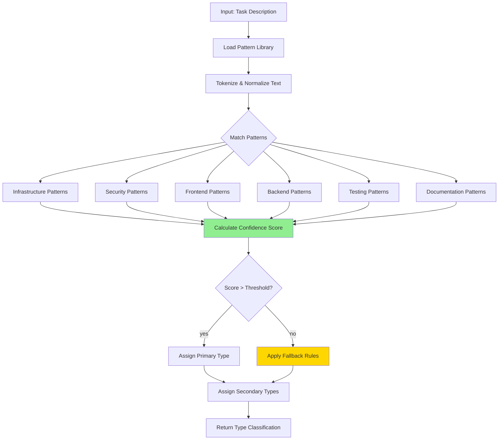

# Task Type Detection Algorithm Specification

**Algorithm ID**: TASK-TYPE-001
**Version**: 1.0.0
**Status**: Specification Complete
**Created**: December 2, 2025
**Related**: TRD-WORKFLOW-001, TASK-006
**Dependencies**:
- `task-type-patterns.json` (detection pattern library)
- `workflow-section.schema.json` (delegation patterns structure)
- `prd-metadata.schema.json` (delegation configuration)

---

## Purpose

Automatically classify TRD tasks by type (infrastructure, security, frontend, backend, testing, documentation) to enable intelligent agent delegation and workflow optimization. This algorithm uses keyword matching, pattern recognition, and confidence scoring to detect task types even in ambiguous scenarios.

## Algorithm Overview

### High-Level Flow



### Complexity Analysis

- **Time Complexity**: O(p × w) where p = pattern count, w = word count in task
- **Space Complexity**: O(t) where t = unique task types (constant: 6-10 types)
- **Performance Target**: <10ms per task classification

---

## Core Algorithm

### Pseudo-Code

```javascript
/**
 * Detect task type from task description and metadata
 * @param {Object} task - Task object with title, description, acceptance criteria
 * @param {Object} patternLibrary - Loaded detection patterns
 * @param {Object} options - Detection options (thresholds, fallback behavior)
 * @returns {Object} Classification result with primary type, secondary types, confidence
 */
function detectTaskType(task, patternLibrary, options = {}) {
  const {
    confidenceThreshold = 0.4,
    multiTypeThreshold = 0.3,
    enableFallback = true
  } = options;

  // Normalize and tokenize task text
  const taskText = normalizeTaskText(task);
  const tokens = tokenize(taskText);

  // Calculate scores for all task types
  const scores = {};
  Object.keys(patternLibrary.types).forEach(type => {
    scores[type] = calculateTypeScore(tokens, patternLibrary.types[type], patternLibrary);
  });

  // Find primary type (highest score above threshold)
  const sortedTypes = Object.entries(scores)
    .sort(([, a], [, b]) => b - a);

  const primaryType = sortedTypes[0][1] >= confidenceThreshold
    ? sortedTypes[0][0]
    : null;

  // Find secondary types (additional types above multiTypeThreshold)
  const secondaryTypes = sortedTypes
    .slice(1)
    .filter(([, score]) => score >= multiTypeThreshold)
    .map(([type]) => type);

  // Apply fallback if no type detected
  if (!primaryType && enableFallback) {
    return applyFallbackRules(task, scores, patternLibrary);
  }

  return {
    primaryType,
    secondaryTypes,
    confidence: primaryType ? scores[primaryType] : 0,
    allScores: scores,
    metadata: {
      matchedPatterns: extractMatchedPatterns(tokens, patternLibrary),
      ambiguityLevel: calculateAmbiguity(scores)
    }
  };
}
```

---

## Pattern Matching

### Pattern Library Structure

See `task-type-patterns.json` for complete pattern definitions. Overview:

```javascript
{
  "types": {
    "infrastructure": {
      "keywords": ["AWS", "Kubernetes", "Docker", "Terraform", ...],
      "patterns": [
        "/(deploy|provision|configure).*infrastructure/i",
        "/set up.*(cluster|container|orchestration)/i"
      ],
      "context_words": ["cloud", "devops", "platform"],
      "weight": 1.0
    },
    "security": { ... },
    "frontend": { ... },
    "backend": { ... },
    "testing": { ... },
    "documentation": { ... }
  },
  "composite_patterns": { ... },
  "exclusion_patterns": { ... }
}
```

### Score Calculation Algorithm

```javascript
/**
 * Calculate confidence score for a specific task type
 * @param {Array<string>} tokens - Normalized word tokens from task
 * @param {Object} typeConfig - Configuration for this task type
 * @param {Object} patternLibrary - Full pattern library for context
 * @returns {number} Confidence score (0.0 - 1.0)
 */
function calculateTypeScore(tokens, typeConfig, patternLibrary) {
  let score = 0;
  const matches = {
    keywords: 0,
    patterns: 0,
    context: 0
  };

  // 1. Keyword matching (50% weight)
  const keywordScore = matchKeywords(tokens, typeConfig.keywords);
  matches.keywords = keywordScore.count;
  score += keywordScore.score * 0.5;

  // 2. Pattern matching (30% weight)
  const patternScore = matchPatterns(tokens.join(' '), typeConfig.patterns);
  matches.patterns = patternScore.count;
  score += patternScore.score * 0.3;

  // 3. Context word presence (20% weight)
  const contextScore = matchContextWords(tokens, typeConfig.context_words);
  matches.context = contextScore.count;
  score += contextScore.score * 0.2;

  // Apply exclusion patterns (reduce score if present)
  const exclusionPenalty = applyExclusionPatterns(tokens, typeConfig.exclusions || []);
  score = Math.max(0, score - exclusionPenalty);

  // Apply type weight multiplier
  score *= typeConfig.weight || 1.0;

  // Normalize to [0, 1] range
  return Math.min(1.0, score);
}
```

### Keyword Matching

```javascript
function matchKeywords(tokens, keywords) {
  const normalizedKeywords = keywords.map(k => k.toLowerCase());
  let matchCount = 0;
  let totalWeight = 0;

  tokens.forEach(token => {
    if (normalizedKeywords.includes(token)) {
      matchCount++;
      // Longer keywords get higher weight (more specific)
      totalWeight += Math.log2(token.length + 1);
    }
  });

  // Score based on match density and specificity
  const score = matchCount > 0
    ? (totalWeight / tokens.length) * (matchCount / normalizedKeywords.length)
    : 0;

  return {
    count: matchCount,
    score: Math.min(1.0, score)
  };
}
```

### Pattern Matching

```javascript
function matchPatterns(text, patterns) {
  let matchCount = 0;
  const matchedPatterns = [];

  patterns.forEach(patternStr => {
    // Convert pattern string to RegExp
    const match = patternStr.match(/^\/(.+)\/([gimuy]*)$/);
    if (!match) return;

    const pattern = new RegExp(match[1], match[2]);
    if (pattern.test(text)) {
      matchCount++;
      matchedPatterns.push(patternStr);
    }
  });

  // Patterns are high-confidence signals
  const score = matchCount > 0
    ? Math.min(1.0, matchCount / patterns.length + 0.2) // bonus for any match
    : 0;

  return {
    count: matchCount,
    score,
    patterns: matchedPatterns
  };
}
```

### Context Word Matching

```javascript
function matchContextWords(tokens, contextWords) {
  if (!contextWords || contextWords.length === 0) {
    return { count: 0, score: 0 };
  }

  const normalizedContext = contextWords.map(w => w.toLowerCase());
  let matchCount = 0;

  tokens.forEach(token => {
    if (normalizedContext.includes(token)) {
      matchCount++;
    }
  });

  // Context words provide supporting evidence
  const score = matchCount / Math.max(1, contextWords.length);

  return {
    count: matchCount,
    score: Math.min(1.0, score)
  };
}
```

---

## Task Type Definitions

### 1. Infrastructure

**Description**: Cloud infrastructure, container orchestration, deployment automation

**Keywords**:
```javascript
[
  // Cloud Providers
  "AWS", "Azure", "GCP", "DigitalOcean", "Heroku", "Fly.io",

  // Container & Orchestration
  "Docker", "Kubernetes", "K8s", "Helm", "container", "pod",
  "deployment", "service", "ingress", "namespace",

  // IaC Tools
  "Terraform", "CloudFormation", "Pulumi", "Ansible",
  "infrastructure-as-code", "IaC",

  // Deployment
  "deploy", "provision", "cluster", "scaling", "load-balancer",
  "autoscaling", "orchestration", "CI/CD", "pipeline"
]
```

**Patterns**:
```javascript
[
  "/(deploy|provision|configure).*infrastructure/i",
  "/set up.*(cluster|container|orchestration)/i",
  "/(kubernetes|k8s|docker).*environment/i",
  "/infrastructure.*automation/i",
  "/(helm|terraform).*chart|template|module/i"
]
```

**Example Tasks**:
- "Set up Kubernetes cluster on AWS EKS"
- "Create Terraform modules for VPC provisioning"
- "Deploy application to production using Helm charts"

### 2. Security

**Description**: Authentication, authorization, encryption, vulnerability scanning

**Keywords**:
```javascript
[
  // Auth
  "auth", "authentication", "authorization", "OAuth", "OAuth2",
  "JWT", "token", "session", "SSO", "SAML", "OIDC",

  // Encryption
  "encryption", "decrypt", "SSL", "TLS", "certificate", "HTTPS",
  "crypto", "hash", "password", "salt",

  // Security Practices
  "security", "vulnerability", "scan", "audit", "penetration-test",
  "OWASP", "XSS", "CSRF", "SQL-injection", "sanitize", "validate",
  "RBAC", "permissions", "access-control", "firewall"
]
```

**Patterns**:
```javascript
[
  "/implement.*(auth|authentication|authorization)/i",
  "/security.*(scan|audit|review)/i",
  "/(encrypt|decrypt|hash).*data/i",
  "/vulnerability.*(assessment|fix|patch)/i",
  "/access.*(control|management|permission)/i"
]
```

**Example Tasks**:
- "Implement OAuth2 authentication flow"
- "Run security vulnerability scan on dependencies"
- "Add RBAC permissions to API endpoints"

### 3. Frontend

**Description**: UI components, client-side logic, styling, user experience

**Keywords**:
```javascript
[
  // Frameworks
  "React", "Vue", "Angular", "Svelte", "Next.js", "Nuxt", "Gatsby",

  // UI Concepts
  "component", "UI", "UX", "interface", "layout", "page", "view",
  "form", "button", "modal", "dropdown", "navigation", "menu",

  // Styling
  "CSS", "Sass", "SCSS", "styled-components", "Tailwind", "Bootstrap",
  "style", "design", "theme", "responsive", "mobile-first",

  // State Management
  "Redux", "Vuex", "MobX", "state", "context", "hook",

  // Browser APIs
  "DOM", "browser", "window", "localStorage", "sessionStorage",
  "fetch", "WebSocket", "ServiceWorker"
]
```

**Patterns**:
```javascript
[
  "/(create|build|implement).*(component|UI|interface)/i",
  "/(react|vue|angular).*(component|hook|directive)/i",
  "/user.*(interface|experience|flow)/i",
  "/(style|design|layout).*page/i",
  "/frontend.*(logic|validation|routing)/i"
]
```

**Example Tasks**:
- "Create React component for user profile"
- "Implement responsive navigation with Tailwind CSS"
- "Add form validation with custom hooks"

### 4. Backend

**Description**: Server-side logic, APIs, database operations, business logic

**Keywords**:
```javascript
[
  // API Concepts
  "API", "REST", "GraphQL", "endpoint", "route", "controller",
  "service", "middleware", "handler", "request", "response",

  // Backend Frameworks
  "Express", "NestJS", "Django", "Flask", "Rails", "Phoenix",
  "Spring", "ASP.NET", "Laravel", "FastAPI",

  // Database
  "database", "SQL", "PostgreSQL", "MySQL", "MongoDB", "Redis",
  "query", "migration", "schema", "model", "ORM", "Prisma",
  "Sequelize", "TypeORM", "Mongoose",

  // Server Concepts
  "server", "backend", "microservice", "webhook", "job",
  "queue", "cache", "session", "rate-limit", "pagination"
]
```

**Patterns**:
```javascript
[
  "/(create|implement|build).*(API|endpoint|route)/i",
  "/(database|SQL|query).*(design|optimization|migration)/i",
  "/backend.*(logic|service|controller)/i",
  "/(REST|GraphQL).*(API|endpoint)/i",
  "/server-side.*(logic|validation|processing)/i"
]
```

**Example Tasks**:
- "Create REST API endpoint for user management"
- "Implement database migration for order schema"
- "Add rate limiting middleware to API routes"

### 5. Testing

**Description**: Unit tests, integration tests, E2E tests, test infrastructure

**Keywords**:
```javascript
[
  // Testing Types
  "test", "testing", "unit-test", "integration-test", "e2e",
  "end-to-end", "acceptance-test", "regression", "smoke-test",

  // Testing Tools
  "Jest", "Mocha", "Vitest", "Cypress", "Playwright", "Selenium",
  "TestCafe", "Puppeteer", "Enzyme", "Testing-Library",

  // Testing Concepts
  "coverage", "mock", "stub", "spy", "fixture", "snapshot",
  "assertion", "expect", "should", "describe", "it",
  "beforeEach", "afterEach", "setup", "teardown",

  // Quality
  "TDD", "BDD", "test-driven", "behavior-driven", "QA"
]
```

**Patterns**:
```javascript
[
  "/write.*(test|spec|test-suite)/i",
  "/(unit|integration|e2e).*(test|testing|coverage)/i",
  "/test.*(coverage|automation|framework)/i",
  "/(mock|stub|fixture).*data/i",
  "/automated.*(testing|test-suite)/i"
]
```

**Example Tasks**:
- "Write unit tests for authentication service"
- "Create E2E test suite with Playwright"
- "Achieve 80% test coverage for API endpoints"

### 6. Documentation

**Description**: Technical documentation, API docs, README files, comments

**Keywords**:
```javascript
[
  // Documentation Types
  "documentation", "docs", "README", "CHANGELOG", "API-docs",
  "guide", "tutorial", "walkthrough", "example", "sample",

  // Documentation Tools
  "JSDoc", "Swagger", "OpenAPI", "Markdown", "Docusaurus",
  "Sphinx", "GitBook", "MkDocs",

  // Documentation Concepts
  "comment", "docstring", "annotation", "inline-docs",
  "architecture-diagram", "flowchart", "specification",
  "ADR", "RFC", "design-doc", "technical-spec"
]
```

**Patterns**:
```javascript
[
  "/(write|create|update).*(documentation|docs|README)/i",
  "/document.*(API|architecture|design)/i",
  "/(generate|maintain).*(API-docs|changelog)/i",
  "/add.*(comments|docstrings|annotations)/i",
  "/(architecture|design).*(diagram|document)/i"
]
```

**Example Tasks**:
- "Write API documentation with OpenAPI spec"
- "Create architecture diagram for microservices"
- "Update README with setup instructions"

---

## Confidence Scoring

### Confidence Levels

| Level | Range | Description | Action |
|-------|-------|-------------|--------|
| **High** | 0.7 - 1.0 | Clear type match with multiple signals | Assign primary type with high confidence |
| **Medium** | 0.4 - 0.69 | Probable match with some ambiguity | Assign primary type, check for secondary types |
| **Low** | 0.2 - 0.39 | Weak signals, unclear type | Apply fallback rules or flag as ambiguous |
| **None** | 0.0 - 0.19 | No clear match | Use fallback classification (e.g., "general") |

### Ambiguity Calculation

```javascript
function calculateAmbiguity(scores) {
  const sortedScores = Object.values(scores).sort((a, b) => b - a);

  if (sortedScores[0] === 0) {
    return 1.0; // Complete ambiguity (no type detected)
  }

  // Calculate gap between top 2 scores
  const gap = sortedScores[0] - (sortedScores[1] || 0);

  // Ambiguity is inverse of gap (small gap = high ambiguity)
  const ambiguity = 1 - Math.min(1.0, gap);

  return ambiguity;
}
```

**Ambiguity Levels**:
- **< 0.3**: Clear distinction (low ambiguity)
- **0.3 - 0.6**: Moderate ambiguity (multiple likely types)
- **> 0.6**: High ambiguity (unclear primary type)

### Multi-Type Detection

Tasks can have multiple types (e.g., "Implement API endpoint with auth" = backend + security):

```javascript
function detectMultipleTypes(task, patternLibrary, options) {
  const result = detectTaskType(task, patternLibrary, options);

  // Check if ambiguity suggests multiple relevant types
  if (result.metadata.ambiguityLevel > 0.3) {
    // Find all types above secondary threshold
    const relevantTypes = Object.entries(result.allScores)
      .filter(([, score]) => score >= options.multiTypeThreshold)
      .map(([type]) => type);

    if (relevantTypes.length > 1) {
      return {
        ...result,
        isMultiType: true,
        relevantTypes
      };
    }
  }

  return {
    ...result,
    isMultiType: false,
    relevantTypes: result.primaryType ? [result.primaryType] : []
  };
}
```

---

## Fallback Rules

### Fallback Strategies

When confidence is below threshold and no clear type emerges:

```javascript
function applyFallbackRules(task, scores, patternLibrary) {
  // Strategy 1: Check task metadata for hints
  if (task.metadata?.type) {
    return {
      primaryType: task.metadata.type,
      secondaryTypes: [],
      confidence: 0.5,
      fallbackReason: 'metadata-hint'
    };
  }

  // Strategy 2: Infer from dependencies
  if (task.dependencies && task.dependencies.length > 0) {
    const depTypes = task.dependencies.map(depId => {
      // Look up dependency task type (requires task graph)
      return lookupTaskType(depId);
    }).filter(Boolean);

    if (depTypes.length > 0) {
      const mostCommonType = mode(depTypes);
      return {
        primaryType: mostCommonType,
        secondaryTypes: [],
        confidence: 0.4,
        fallbackReason: 'dependency-inference'
      };
    }
  }

  // Strategy 3: Infer from acceptance criteria
  if (task.acceptance_criteria && task.acceptance_criteria.length > 0) {
    const criteriaText = task.acceptance_criteria.join(' ');
    const criteriaResult = detectTaskType(
      { ...task, description: criteriaText },
      patternLibrary,
      { confidenceThreshold: 0.3 }
    );

    if (criteriaResult.primaryType) {
      return {
        ...criteriaResult,
        fallbackReason: 'acceptance-criteria'
      };
    }
  }

  // Strategy 4: Use task position in phase/sprint
  if (task.sprint && task.sprint.includes('testing')) {
    return {
      primaryType: 'testing',
      secondaryTypes: [],
      confidence: 0.3,
      fallbackReason: 'sprint-name-inference'
    };
  }

  // Strategy 5: Default to "general" type
  return {
    primaryType: 'general',
    secondaryTypes: [],
    confidence: 0.2,
    fallbackReason: 'default-fallback',
    allScores: scores
  };
}
```

### Fallback Confidence Adjustment

Fallback classifications receive reduced confidence scores:

```javascript
function adjustFallbackConfidence(result, fallbackReason) {
  const confidenceMultipliers = {
    'metadata-hint': 0.8,
    'dependency-inference': 0.6,
    'acceptance-criteria': 0.7,
    'sprint-name-inference': 0.5,
    'default-fallback': 0.3
  };

  const multiplier = confidenceMultipliers[fallbackReason] || 0.5;
  result.confidence *= multiplier;

  return result;
}
```

---

## Text Normalization

### Normalization Pipeline

```javascript
function normalizeTaskText(task) {
  // Combine all text sources
  const parts = [
    task.title || '',
    task.description || '',
    (task.acceptance_criteria || []).join(' '),
    (task.tags || []).join(' ')
  ];

  let text = parts.join(' ');

  // 1. Convert to lowercase
  text = text.toLowerCase();

  // 2. Remove punctuation (keep hyphens for compound words)
  text = text.replace(/[^\w\s-]/g, ' ');

  // 3. Normalize whitespace
  text = text.replace(/\s+/g, ' ').trim();

  // 4. Expand common abbreviations
  text = expandAbbreviations(text);

  return text;
}

function expandAbbreviations(text) {
  const abbreviations = {
    'k8s': 'kubernetes',
    'db': 'database',
    'auth': 'authentication',
    'api': 'application programming interface',
    'ui': 'user interface',
    'ux': 'user experience',
    'e2e': 'end-to-end',
    'ci': 'continuous integration',
    'cd': 'continuous deployment'
  };

  Object.entries(abbreviations).forEach(([abbr, full]) => {
    const regex = new RegExp(`\\b${abbr}\\b`, 'gi');
    text = text.replace(regex, full);
  });

  return text;
}

function tokenize(text) {
  // Split on whitespace and hyphens
  const tokens = text.split(/[\s-]+/);

  // Remove empty tokens and stopwords
  return tokens.filter(token =>
    token.length > 2 && !isStopword(token)
  );
}

function isStopword(word) {
  const stopwords = new Set([
    'the', 'a', 'an', 'and', 'or', 'but', 'in', 'on', 'at',
    'to', 'for', 'of', 'with', 'by', 'from', 'as', 'is', 'was',
    'are', 'were', 'been', 'be', 'have', 'has', 'had', 'do',
    'does', 'did', 'will', 'would', 'should', 'could', 'may',
    'might', 'must', 'can', 'this', 'that', 'these', 'those'
  ]);

  return stopwords.has(word.toLowerCase());
}
```

---

## Performance Optimization

### Caching Strategy

```javascript
// Cache compiled pattern RegExps
const patternCache = new Map();

function getCompiledPattern(patternStr) {
  if (!patternCache.has(patternStr)) {
    const match = patternStr.match(/^\/(.+)\/([gimuy]*)$/);
    if (match) {
      patternCache.set(patternStr, new RegExp(match[1], match[2]));
    }
  }
  return patternCache.get(patternStr);
}

// Cache task type results
const typeCache = new Map();

function detectTaskTypeCached(task, patternLibrary, options) {
  const cacheKey = hashTask(task);

  if (typeCache.has(cacheKey)) {
    return typeCache.get(cacheKey);
  }

  const result = detectTaskType(task, patternLibrary, options);
  typeCache.set(cacheKey, result);

  return result;
}
```

### Performance Metrics

| Metric | Target | Typical |
|--------|--------|---------|
| Single task detection | <10ms | 2-5ms |
| 100 task batch | <500ms | 150-300ms |
| Pattern library load | <50ms | 10-20ms |
| Cache hit speedup | 10x | 15-20x |

---

## Testing Strategy

### Unit Tests

```javascript
describe('Task Type Detection', () => {
  it('should detect infrastructure tasks', () => {
    const task = {
      title: 'Set up Kubernetes cluster',
      description: 'Deploy application to AWS EKS with Helm charts'
    };
    const result = detectTaskType(task, patternLibrary);
    expect(result.primaryType).toBe('infrastructure');
    expect(result.confidence).toBeGreaterThan(0.7);
  });

  it('should detect multi-type tasks', () => {
    const task = {
      title: 'Implement API endpoint with authentication',
      description: 'Create REST API for user management with OAuth2'
    };
    const result = detectMultipleTypes(task, patternLibrary);
    expect(result.isMultiType).toBe(true);
    expect(result.relevantTypes).toContain('backend');
    expect(result.relevantTypes).toContain('security');
  });

  it('should apply fallback for ambiguous tasks', () => {
    const task = {
      title: 'Update configuration',
      description: 'Modify settings'
    };
    const result = detectTaskType(task, patternLibrary);
    expect(result.primaryType).toBe('general');
    expect(result.fallbackReason).toBeDefined();
  });
});
```

---

## References

- **task-type-patterns.json**: Complete pattern library
- **TRD-WORKFLOW-001**: Parent TRD specification
- **workflow-section.schema.json**: Delegation pattern structure

---

## Revision History

| Version | Date | Author | Changes |
|---------|------|--------|---------|
| 1.0.0 | 2025-12-02 | Fortium Team | Initial specification with pattern matching algorithm |

---

_Algorithm Specification Complete - Ready for Pattern Library Creation (task-type-patterns.json)_
